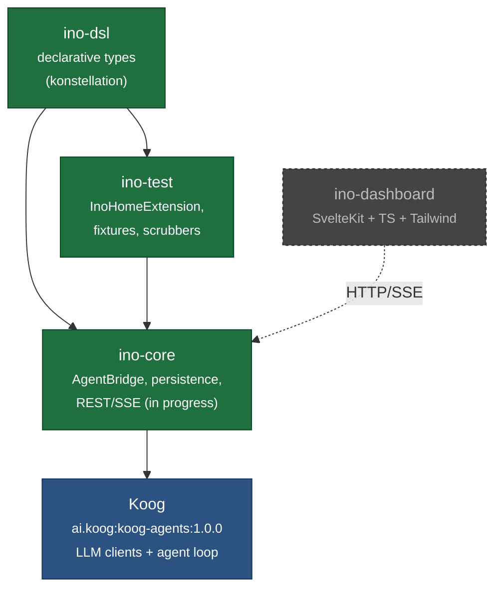

# `ino` — Documentation Index

`ino` is a Kotlin/Svelte agentic framework. The DSL (`ino-dsl`) declares agents, tools, and provider configurations as typed Kotlin via konstellation; the runtime delegates to **Koog** (`ai.koog:koog-agents`) for LLM calls, the agent loop, streaming, and tool dispatch. `ino-core` is the Spring Boot host that glues them together, persists conversation state in SQLite, and exposes a REST + SSE API.

Heavier feature set (skills, multi-platform gateways, MCP enhancements, cron, cost dashboards) is deferred to phase 2 — each its own spec → plan → build cycle.

## Reading order

| Doc | Purpose | Audience |
|---|---|---|
| [architecture.md](architecture.md) | Module map, where Koog fits, end-to-end request flow | Anyone new to the codebase |
| [dsl.md](dsl.md) | konstellation-generated DSL surface — `Agent`, `Tool`, `ProviderConfig` | DSL users |
| [engine.md](engine.md) | `AgentBridge` (DSL → Koog), capabilities, streaming, tools | Engine contributors |
| [persistence.md](persistence.md) | SQLite schema, Liquibase migrations, repository layer | Backend contributors |
| [api.md](api.md) | REST + SSE surface, session lifecycle | API consumers |
| [dashboard.md](dashboard.md) | SvelteKit dashboard, components, Storybook, Playwright | Frontend contributors |
| [testing.md](testing.md) | Test pyramid, `INO_HOME` isolation, smoke tests | All contributors |
| [cicd.md](cicd.md) | GitHub Actions workflows, publishing, verification metadata | Maintainers |
| [roadmap.md](roadmap.md) | MVP build sequence, phase 2 sub-projects, phase 3, decision log | Anyone |

## Module map

Solid arrows are compile-time dependencies; dashed are runtime relationships.

## Current status

- `ino-dsl` — **built**. konstellation wired, all DSL types compiling. See [dsl.md](dsl.md).
- `ino-core` — **built (in progress)**. Spring Boot host with Liquibase schema, `JdbcClient` repos, `ConversationStore`, `AgentBridge`. REST/SSE controllers next.
- `ino-test` — **built**. `InoHomeExtension`, `CredentialScrubber`, `FixedClockConfig`.
- Koog integration — **proven**. `AgentBridge` translates DSL `Agent` → Koog `AIAgent`; live smoke tests pass against llama-server's `qwen3-coder`.
- `ino-dashboard` — **planned**. SvelteKit shell.

See [roadmap.md](roadmap.md) for the full build sequence and remaining MVP acceptance criteria.

## Reference projects

| Project | Role | Path |
|---|---|---|
| `hermes-agent` | Python agent framework whose feature set inspired the original spec | `/khorum/agents/hermes-agent` |
| `agent-sandbox` | First Koog spike (single hardcoded agent against llama-server) | `/khorum/agents/agent-sandbox` |
| `spektr` | Reference for Gradle / publishing / CI patterns | `/khorum/spektr` |
| `konstellation-dsl` | KSP processor that generates DSL builders | `/khorum/konstellation-dsl` |
| `tabs` | Reference for konstellation usage patterns | `/khorum/tabs` |
| **Koog (JetBrains)** | The agent runtime ino delegates to | `https://github.com/jetbrains/koog` |

## Conventions

- Group: `org.khorum.oss.ino`
- Dependency repo: `https://open-reliquary.nyc3.digitaloceanspaces.com` (DigitalOcean Spaces)
- JVM target: Java 21
- Kotlin: 2.3.10 in `ino-core` / `ino-test`; 2.1.20 in `ino-dsl` (pinned to konstellation's KSP version until upstream bump)
- DB: SQLite (`~/.ino/state.db` by default), Liquibase migrations
- Timestamps: ISO-8601 UTC TEXT in SQLite and JSON; `java.time.Instant` in Kotlin
- Cost: `Long` micros (1 USD = 1_000_000 micros), no floats
- Agent runtime: Koog 1.0.0 (single `ai.koog:koog-agents` artifact)
