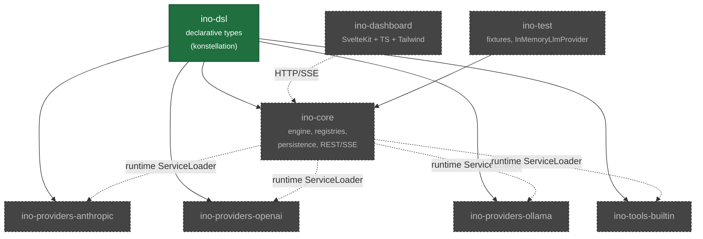

# `ino` — Documentation Index

`ino` is a Kotlin/Svelte agentic framework. The MVP delivers a small, well-bounded core that proves the architecture end-to-end; the heavier feature set (skills, multi-platform gateways, MCP, cron, cost dashboards) is explicitly deferred to phase 2 sub-projects, each with its own spec → plan → build cycle.

## Reading order

| Doc | Purpose | Audience |
|---|---|---|
| [architecture.md](architecture.md) | Module map, ServiceLoader extension model, system context | Anyone new to the codebase |
| [dsl.md](dsl.md) | konstellation-generated DSL surface; what's actually built | DSL users |
| [engine.md](engine.md) | Execution loop, provider SPI, tool SPI, `CompletionEvent` stream | Engine contributors |
| [persistence.md](persistence.md) | SQLite schema, Liquibase migrations, repository layer | Backend contributors |
| [api.md](api.md) | REST + SSE surface, session lifecycle | API consumers |
| [dashboard.md](dashboard.md) | SvelteKit dashboard, components, Storybook, Playwright | Frontend contributors |
| [testing.md](testing.md) | Test pyramid, captured fixtures, `INO_HOME` isolation | All contributors |
| [cicd.md](cicd.md) | GitHub Actions workflows, publishing, verification metadata | Maintainers |
| [roadmap.md](roadmap.md) | MVP build sequence, phase 2 sub-projects, phase 3 | Anyone |

## Module map

Solid arrows are compile-time dependencies; dashed are runtime relationships.

## Current status (2026-05-04)

- `ino-dsl` — **built**. konstellation wired, all eight DSL types compiling, full agent definition surface working end-to-end. See [dsl.md](dsl.md).
- Everything else — **planned**. See [roadmap.md](roadmap.md) for the build sequence.

## Reference projects

| Project | Role | Path |
|---|---|---|
| `hermes-agent` | Original Python agent framework being replicated in Kotlin | `/khorum/agents/hermes-agent` |
| `ino` (this) | Stub on disk; this plan replaces it | `/khorum/agents/ino` |
| `spektr` | Reference for ServiceLoader-based extension JARs and the build pattern | `/khorum/spektr` |
| `konstellation-dsl` | KSP processor that generates DSL builders | `/khorum/konstellation-dsl` |
| `tabs` | Reference for konstellation usage patterns | `/khorum/tabs` |

## Conventions

- Group: `org.khorum.oss.ino`
- Dependency repo: `https://open-reliquary.nyc3.digitaloceanspaces.com` (DigitalOcean Spaces)
- JVM target: Java 21
- Kotlin: 2.3.0 across most modules; 2.1.20 in `ino-dsl` (pinned to konstellation's KSP version until upstream bump)
- DB: SQLite (`~/.ino/state.db` by default), Liquibase migrations
- Timestamps: ISO-8601 UTC TEXT in SQLite and JSON; `java.time.Instant` in Kotlin
- Cost: `Long` micros (1 USD = 1_000_000 micros), no floats
