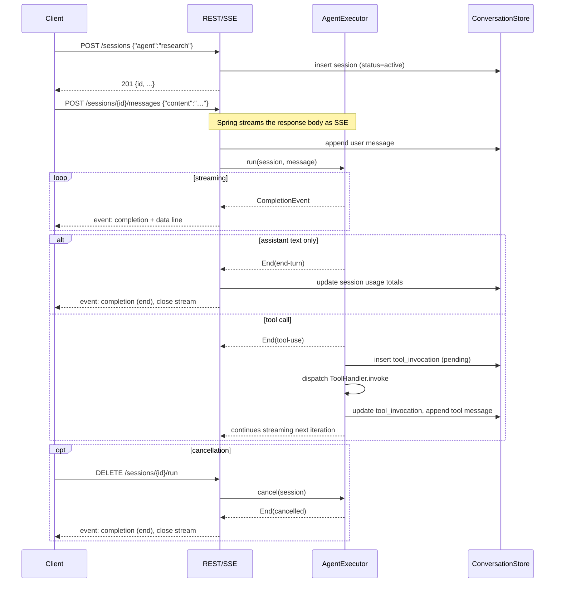

# REST + SSE API

`ino-core` exposes a small REST surface plus one SSE streaming endpoint for live agent execution. WebSocket (bidirectional control) is deferred to phase 2.

## Endpoint reference

| Method | Path | Purpose |
|---|---|---|
| `POST` | `/sessions` | Create a session for an agent |
| `GET` | `/sessions/{id}` | Session metadata |
| `GET` | `/sessions/{id}/messages` | Full message history |
| `POST` | `/sessions/{id}/messages` | Append user message; **returns SSE stream** of `CompletionEvent`s |
| `DELETE` | `/sessions/{id}/run` | Cancel in-flight execution |
| `GET` | `/agents` | List registered agent definitions |
| `GET` | `/providers` | Provider registry introspection |
| `GET` | `/tools` | Tool registry introspection (with schemas) |
| `GET` | `/sessions` | Paginated session list (filterable by agent) |

## DTO shapes

```kotlin
// POST /sessions request
data class CreateSessionRequest(val agent: String)

// Session response
data class SessionDto(
    val id: String,                    // UUID v7
    val agentName: String,
    val providerId: String,
    val model: String,
    val status: String,                // active | completed | failed | cancelled
    val startedAt: String,             // ISO-8601 UTC
    val endedAt: String?,
    val totalInputTokens: Long,
    val totalOutputTokens: Long,
    val totalCostUsdMicros: Long,
)

// POST /sessions/{id}/messages request
data class AppendMessageRequest(val content: String)

// Message response
data class MessageDto(
    val id: String,
    val sessionId: String,
    val seq: Int,
    val role: String,                  // system | user | assistant | tool
    val content: String?,
    val reasoning: String?,
    val toolCallId: String?,
    val toolCallsJson: String?,
    val inputTokens: Int?,
    val outputTokens: Int?,
    val createdAt: String,             // ISO-8601 UTC
)
```

JSON serialized via Jackson + `KotlinModule()` + `JavaTimeModule()` with `WRITE_DATES_AS_TIMESTAMPS=false`.

## SSE event format

The SSE stream returned by `POST /sessions/{id}/messages` mirrors the internal `CompletionEvent` sealed type. Each event has a `type` discriminator:

```
event: completion
data: {"type":"text-delta","text":"Looking up "}

event: completion
data: {"type":"text-delta","text":"the weather…"}

event: completion
data: {"type":"tool-call-start","id":"call_abc","name":"web_search"}

event: completion
data: {"type":"tool-call-args-delta","id":"call_abc","argsJsonChunk":"{\"query\":\"…"}

event: completion
data: {"type":"tool-call-end","id":"call_abc"}

event: completion
data: {"type":"end","stopReason":"tool-use","usage":{"inputTokens":123,"outputTokens":45,"costUsdMicros":1200}}
```

When an `End(stopReason = "tool-use")` event arrives, the **server** dispatches the tool internally (via `ToolRegistry`) and continues the stream. The client doesn't need to do anything — when the next assistant text starts arriving, the loop has already advanced.

A final `End(stopReason = "end-turn")` (or `max-tokens`, `error`, `budget-exhausted`, `cancelled`) closes the SSE channel.

## Session lifecycle



## Pagination

`GET /sessions` accepts:

| Param | Type | Default | Notes |
|---|---|---|---|
| `agent` | `String?` | `null` | filter to one agent's sessions |
| `limit` | `Int` | `50` | max 200 |
| `offset` | `Int` | `0` | |
| `status` | `String?` | `null` | filter by status |

Results sorted `started_at DESC`. Cursor-based pagination is a phase-2 enhancement.

## Authentication

MVP assumes single-user local deployment. Spring Security is wired in but with `permitAll()` on a dedicated profile (`spring.profiles.active=local`).

Multi-user auth (token-based, OIDC, etc.) lives in phase 2 — when the `provider { custom = ... }` escape hatch and gateway extensions arrive, multi-tenant becomes meaningful.

## Status codes

| Code | Meaning |
|---|---|
| `200` | Success (sync endpoints) |
| `201` | Session created |
| `204` | Cancellation accepted |
| `400` | Malformed request body or invalid agent name |
| `404` | Session / agent / tool not found |
| `409` | Attempt to append to a session that's already terminal |
| `422` | Schema validation failure (e.g. missing required field on a configured agent) |
| `503` | Engine reports all configured providers exhausted |

SSE failures (e.g. provider error mid-stream) emit `End(stopReason = "error")` and close cleanly with HTTP 200 — error details live in the event payload, not in the HTTP status.

## OpenAPI

Phase-1.5: add `springdoc-openapi` to `ino-core` and codegen TypeScript types into `ino-dashboard` via `openapi-typescript`. For the MVP, the dashboard's `src/lib/api/types.ts` is hand-written (~6 endpoints, small surface).
