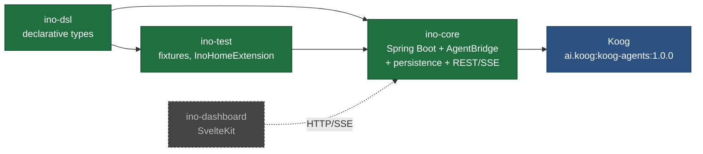
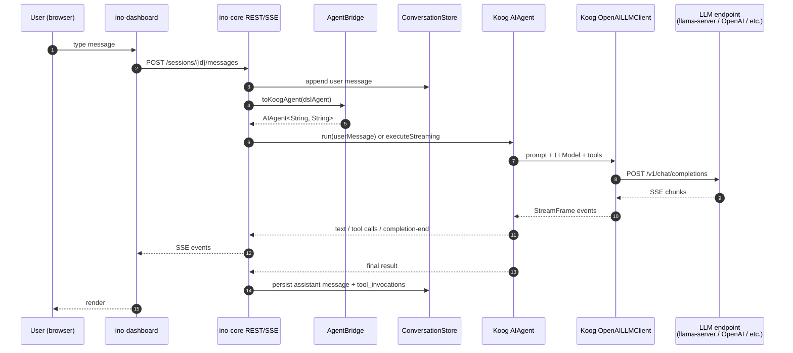
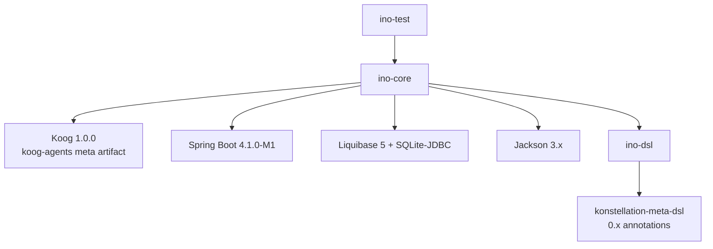

# Architecture

`ino` is a thin Spring Boot host around two pieces:

1. **`ino-dsl`** — declarative agent / tool / provider definitions, produced by konstellation as typed Kotlin builders.
2. **Koog** (`ai.koog:koog-agents`) — JetBrains' Kotlin agent framework, which handles LLM clients, the agent loop, streaming, tool dispatch, MCP, and fallback chains.

`ino-core` is the glue: it translates DSL declarations into Koog `AIAgent` instances via the `AgentBridge`, persists sessions/messages/tool invocations in SQLite, and exposes a REST + SSE API for the dashboard.

The original spec called for custom `LlmProvider` / `ToolHandler` / `CompletionEvent` SPIs plus three separate provider extension JARs. Those were dropped after Koog adoption — Koog already implements all of them. The konstellation DSL becomes more valuable, not less: it's the *user-facing* layer that compiles down to Koog's machine-facing API. See `roadmap.md` decision log.

## Why this shape

Three forces drove the current design:

1. **Framework first, product later.** The MVP delivers a small, well-bounded core with extension points; phase-2 features (skills, memory, gateways, MCP, cron) layer on top.
2. **Reuse what works.** `spektr` runs the same Gradle / publishing / CI patterns in production. `konstellation-dsl` already generates type-safe builders. Koog already runs agent loops against every major LLM. Composing them is faster than reinventing any of them.
3. **Open extension via the DSL's `custom` slot.** Third-party `LlmProviderConfig` implementations plug in via `ProviderConfig.custom` (see [dsl.md](dsl.md)). The bridge will route them by class registry — see the deferred `@Enhancement` notes in `AgentBridge`.

## Module map

| Module | Role | Status |
|---|---|---|
| `ino-dsl` | Pure data — `Agent`, `Tool`, `ToolParameter`, `LlmProviderConfig` etc. via konstellation | Built |
| `ino-core` | Spring Boot 4.1 — `AgentBridge`, SQLite persistence (sessions/messages/tool_invocations), `JdbcClient` repos, REST + SSE (in progress) | Built (REST/SSE pending) |
| `ino-test` | `InoHomeExtension`, `CredentialScrubber`, `FixedClockConfig`, fixture helpers | Built |
| `ino-dashboard` | SvelteKit + TypeScript + Tailwind v4 + Storybook 8 + Playwright | Planned |
| **External: Koog** | Agent runtime: LLM clients, agent loop, tool dispatch, streaming, MCP | Pulled as one Maven artifact |

**Modules that aren't being built** (originally planned, now replaced by Koog):
- ~~`ino-providers-anthropic` / `-openai` / `-ollama`~~ — Koog has all of them
- ~~`ino-tools-builtin`~~ — Koog's `ToolRegistry` + `@Tool` annotations replace it
- ~~ServiceLoader-based extension JAR mechanism~~ — not needed when Koog already provides multi-provider routing

## End-to-end request flow

The REST/SSE controller layer is the next planned piece; today the bridge is exercised directly by tests (see `KoogBridgeLlamaSmokeTest`).

## Build & runtime contract

- Single Gradle root at `khorum/agents/ino/` with submodules `:ino-dsl`, `:ino-core`, `:ino-test`. Build via `./gradlew :ino-core:bootRun`, etc.
- Each submodule has its own `VERSION` file; bumps are independent.
- Production deployment: a single `ino-core` Spring Boot JAR with Koog on the classpath + bundled SvelteKit static assets at `/dashboard/**`.
- Kotlin versions: `ino-dsl` on 2.1.20 (pinned to konstellation's KSP); `ino-core` and `ino-test` on 2.3.10 (Koog requires 2.3.10+). Generated DSL bytecode is binary-compatible across both.
- Java toolchain: 21 across all modules.

## Dependency layers (compile-time)

`konstellation-meta-dsl` is exposed as an `api` dependency from `ino-dsl` so that consumers (`ino-core`) can see the `CoreDslBuilder` supertype of generated builders.

See [cicd.md](cicd.md) for the publishing flow and [roadmap.md](roadmap.md) for what gets built when.
