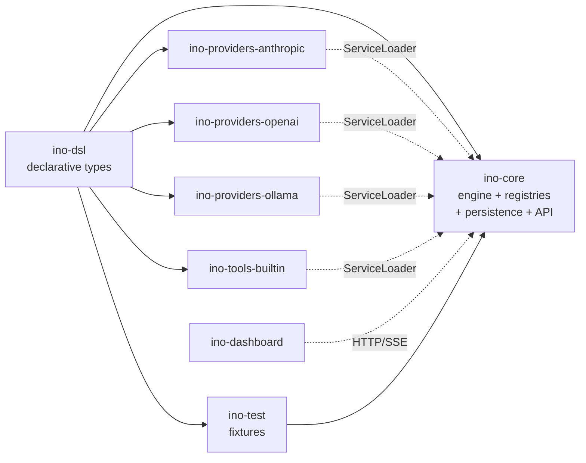
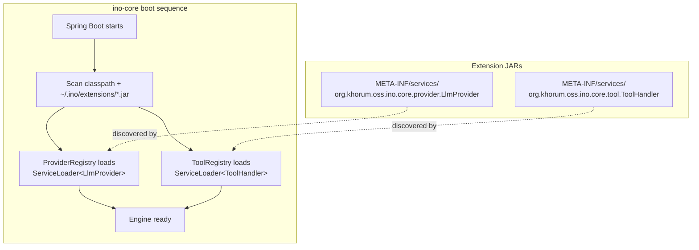
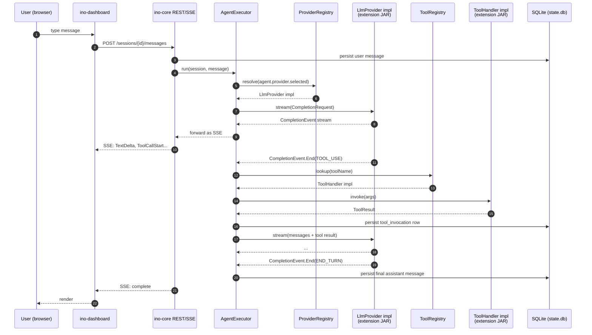

# Architecture

`ino` follows the **spektr-mirror** shape: a tiny Spring Boot core that loads provider/tool implementations as runtime extension JARs via `ServiceLoader`. The framework itself stays small; everything extensible ships as an independently versioned artifact.

## Why this shape

Three forces drove the choice:

1. **Framework first, product later.** The MVP must produce a usable, publishable framework. Phase-2 features (skills, memory, gateways, MCP, cron) become new extension JARs without changing the core.
2. **Reuse what works.** `spektr` already runs this pattern in production for REST/SOAP endpoints. The Gradle plugin, publishing pipeline, CI templates, and verification-metadata flow are already wired up for this exact module shape.
3. **Open extension, closed core.** Anyone can write a new `LlmProvider` or `ToolHandler` without touching `ino-core` source — they ship a JAR, drop it in `~/.ino/extensions/`, and the registry picks it up at startup.

## Module map

| Module | Role | Status |
|---|---|---|
| `ino-dsl` | Pure data — `Agent`, `Tool`, `LlmProviderConfig` etc. via konstellation | Built |
| `ino-core` | Spring Boot 4.1 — engine, registries, SQLite persistence, REST + SSE | Planned |
| `ino-test` | `InMemoryLlmProvider`, `INO_HOME` JUnit extension, fixture helpers | Planned |
| `ino-providers-anthropic` | Anthropic Messages API adapter; registers as `LlmProvider` | Planned |
| `ino-providers-openai` | OpenAI Chat/Responses adapter | Planned |
| `ino-providers-ollama` | Ollama HTTP adapter (local) | Planned |
| `ino-tools-builtin` | `shell`, `http_get`, `file_read`, `file_write`, `web_search` tools | Planned |
| `ino-dashboard` | SvelteKit + TypeScript + Tailwind v4 + Storybook 8 + Playwright | Planned |

## ServiceLoader extension model

Each extension JAR is a regular Gradle subproject, shadow-built with `org/khorum/oss/ino/dsl/**` excluded (the DSL is provided by core to avoid duplicate classloading).

## End-to-end request flow

## Build & runtime contract

- Each Gradle subproject under `ino/` is a submodule of a single Gradle root at `khorum/agents/ino/` (the tabs pattern). Build via `./gradlew :ino-dsl:build`, `./gradlew :ino-core:bootRun`, etc.
- Each subproject has its own `VERSION` file; bumps are independent.
- Provider/tool extension JARs publish to DigitalOcean Spaces under `org.khorum.oss.ino:<artifact>:<version>`.
- Production deployment: a single `ino-core` boot JAR with built-in providers/tools on the classpath, plus the bundled SvelteKit static assets at `/dashboard/**`.

See [cicd.md](cicd.md) for the publishing flow and [roadmap.md](roadmap.md) for what gets built when.
