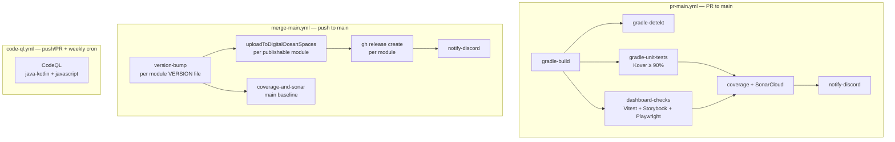

# CI/CD

Three GitHub Actions workflows per the standard monorepo pattern (mirroring spektr, konstellation-dsl, etc.). Each subproject has its own `.github/workflows/` directory and reuses the shared workflows from `khorum-oss/public-cicd`.

## The three workflows



## `pr-main.yml` — PR validation

Triggered on PRs targeting `main`. Concurrency group: `pr-${{ github.event.pull_request.number }}`, cancel-in-progress.

| Job | Reusable workflow                                                | Notes |
|---|------------------------------------------------------------------|---|
| `build-check` | `khorum-oss/public-cicd/.github/workflows/gradle-build.yml`      | Fast-fail compilation per module |
| `detekt-check` | `khorum-oss/public-cicd/.github/workflows/gradle-detekt.yml`     | Static analysis |
| `unit-tests` | `khorum-oss/public-cicd/.github/workflows/gradle-unit-tests.yml` | Kover XML, ≥ 90% per module |
| `dashboard-checks` | custom inline                                                    | Vitest unit, Storybook build, Playwright vs locally-built core |
| `coverage-and-sonar` | custom inline                                                    | Combined Kover + Vitest XML upload to Codecov; SonarCloud scan |
| `notify-discord` | `khorum-oss/public-cicd/.github/workflows/notify-discord.yml`    | Result summary |

## `merge-main.yml` — release & publish

Triggered on push to `main` plus manual dispatch. Concurrency group: `merge-main`, **no** cancel-in-progress (releases must complete).

| Job | Action | Outputs |
|---|---|---|
| `version` | Bump `VERSION` file via `version-bump.yml` if content hash changed | New version per module |
| `publish` | Reads `VERSION`, runs `./gradlew uploadToDigitalOceanSpaces` per publishable module | Artifacts at `org.khorum.oss.ino:<artifact>:<version>` on DO Spaces |
| `coverage-and-sonar` | Main-baseline coverage upload + SonarCloud baseline | Updated quality gates |
| `release` | `gh release create "v${VERSION}"` per module with auto-generated notes | GitHub releases |
| `notify-discord` | Discord webhook summary | Channel post |

CI secrets required:

| Secret | Used by |
|---|---|
| `DO_SPACES_API_KEY` | DigitalOcean publishing |
| `DO_SPACES_SECRET` | DigitalOcean publishing |
| `GPG_SIGNING_KEY` | Artifact signing (in-memory) |
| `GPG_SIGNING_PASSWORD` | Artifact signing |
| `SONAR_TOKEN` | SonarCloud scan |
| `CODECOV_TOKEN` | Coverage upload |
| `DISCORD_WEBHOOK_URL` | Discord notifications |
| `ANTHROPIC_API_KEY` (optional) | Live provider smoke tests in nightly job |

## `code-ql.yml` — security analysis

Triggered on push/PR to `main` and `develop`, plus weekly cron. Single job runs CodeQL for `java-kotlin` and `javascript` languages.

## Reusable workflows from `khorum-oss/public-cicd`

| Workflow | Purpose |
|---|---|
| `gradle-build.yml` | Fast-fail compilation check |
| `gradle-unit-tests.yml` | Unit tests with Kover coverage |
| `gradle-context-tests.yml` | Integration / context tests |
| `gradle-detekt.yml` | Detekt static analysis |
| `gradle-task-commit.yml` | Run a Gradle task and commit changes back to the PR |
| `version-bump.yml` | Bump VERSION file and commit |
| `notify-discord.yml` | Discord notifications |

Composite actions:

| Action | Purpose |
|---|---|
| `setup-java-gradle` | Java 21 + Gradle wrapper + caching |
| `setup-node` | Node + pnpm caching |
| `check-path-changes` | Detect if specific paths changed |

## Verification metadata

Each publishable module ships `gradle/verification-metadata.xml` per the monorepo standard:

- `verify-metadata: true` — checksums verified for all dependencies
- `verify-signatures: true` — PGP signature verification enabled
- `trusted-artifacts` — well-known groups trusted via regex (e.g. `org.jetbrains`, `org.apache`, `org.khorum`, `org.slf4j`)
- `ignored-keys` — keys that couldn't be downloaded from key servers, listed with reason
- `trusted-keys` — specific PGP key IDs mapped to trusted artifact groups

When dependencies change, regenerate via:

```bash
./gradlew --write-verification-metadata sha256,pgp help
```

A dry-run variant (`gradle/verification-metadata.dryrun.xml` with `verify-signatures: false` and SHA-256-only) supports local testing without signing infrastructure.

## Artifact signing (GPG)

The `maven-generated-artifacts` plugin handles signing automatically. Key resolution order:

1. File: `khorum-signing.asc` at the project root
2. Env var: `GPG_SIGNING_KEY` (used in CI)
3. If neither found, signing is skipped

Password resolution:

1. Gradle property `signing.password`
2. Env var `GPG_SIGNING_PASSWORD`

When both key and password are available, the plugin applies Gradle's `signing` plugin and calls `useInMemoryPgpKeys()` to sign all publications. The `digital-ocean-spaces` plugin enforces signing by default (`signingRequired = true`); the upload task checks for `.asc` files in `build/libs/` before uploading and fails if none are found.

## Per-module independence

The MVP plan ships these publishable modules:

| Module | Artifact ID | Purpose |
|---|---|---|
| `ino-dsl` | `org.khorum.oss.ino:ino-dsl` | Compile-time dependency for everything else |
| `ino-core` | `org.khorum.oss.ino:ino-core` | The Spring Boot engine + REST/SSE |
| `ino-test` | `org.khorum.oss.ino:ino-test` | Test fixtures (depended on by all other test suites) |
| `ino-providers-anthropic` | `org.khorum.oss.ino:ino-providers-anthropic` | Runtime extension JAR |
| `ino-providers-openai` | `org.khorum.oss.ino:ino-providers-openai` | Runtime extension JAR |
| `ino-providers-ollama` | `org.khorum.oss.ino:ino-providers-ollama` | Runtime extension JAR |
| `ino-tools-builtin` | `org.khorum.oss.ino:ino-tools-builtin` | Runtime extension JAR |
| `ino-dashboard` | tarball or bundled into `ino-core` | Static UI assets |

Each version-bumps independently based on content-hash diff (the `spektr-gradle-plugin` pattern, eventually forked into `ino-gradle-plugin` in phase 3).

## Phase 2 additions

- Container build & push for `ino-core` (Docker Hub or GHCR) via `docker-build-push.yml`
- DigitalOcean SSH deploy for hosted demo via `deploy-digitalocean-ssh.yml`
- Per-PR preview deployments of the dashboard
