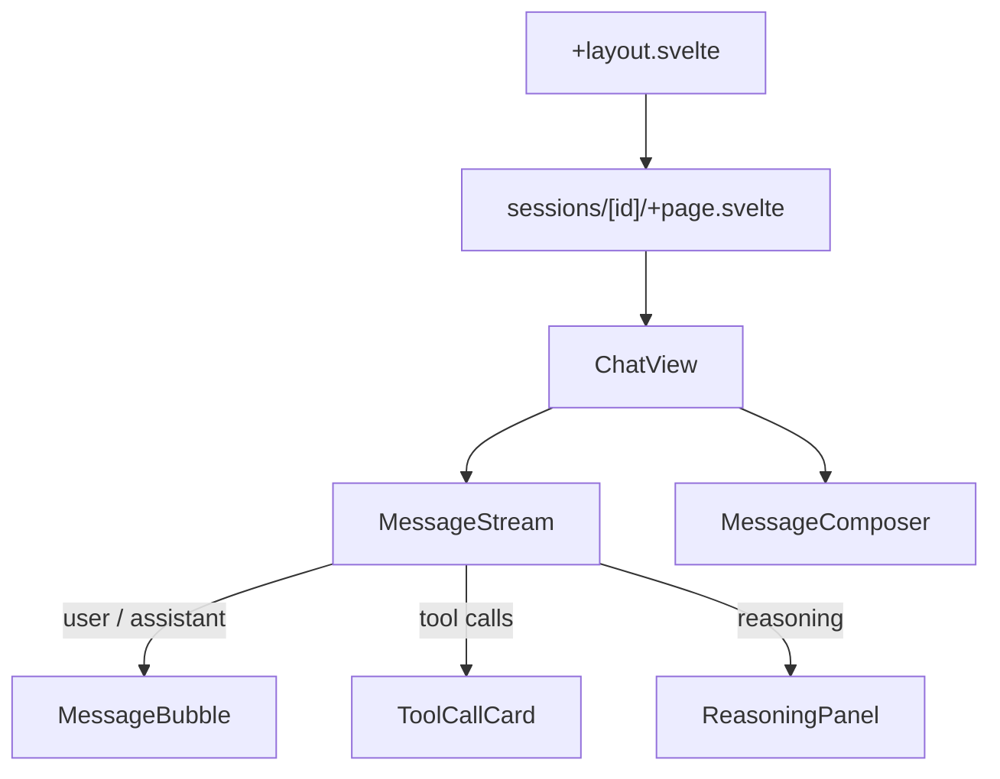
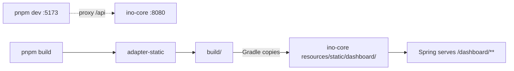

# Dashboard (`ino-dashboard`)

The user-facing UI. SvelteKit + TypeScript strict + Tailwind v4 + Storybook 8 + Playwright + Vitest, packaged with pnpm. Embedded into `ino-core` for production deployments; runs on a separate Vite dev server during development.

## Stack

| Layer | Choice | Rationale |
|---|---|---|
| Framework | SvelteKit 2 + Svelte 5 (runes) | Modern reactivity, light runtime, minimal ceremony |
| Language | TypeScript (strict mode) | End-to-end type safety with the API DTOs |
| Styling | Tailwind CSS v4 | Zero-config plugin; minimal custom CSS |
| Component review | Storybook 8 | Per-component visual workshop; doubles as visual-regression baseline |
| E2E | Playwright | Real-browser testing against `ino-core` + `InMemoryLlmProvider` |
| Unit | Vitest + V8 coverage | Stores, SSE parser, format helpers |
| Package manager | pnpm | Determinism, smaller node_modules |

## Project layout

```
ino-dashboard/
├── src/
│   ├── lib/
│   │   ├── api/
│   │   │   ├── client.ts             # fetch wrapper (base URL, auth header)
│   │   │   ├── types.ts              # mirror of ino-core DTOs (hand-curated for MVP)
│   │   │   └── sse.ts                # EventSource → typed AsyncIterable<CompletionEvent>
│   │   ├── stores/
│   │   │   ├── sessions.svelte.ts
│   │   │   ├── activeSession.svelte.ts
│   │   │   └── registry.svelte.ts    # agents, providers, tools introspection
│   │   └── components/
│   │       ├── chat/                 # MessageBubble, MessageStream, ToolCallCard, ReasoningPanel
│   │       ├── session/              # SessionList, SessionCard, NewSessionDialog
│   │       ├── registry/             # AgentBadge, ProviderBadge, ToolBadge
│   │       └── ui/                   # primitives: Button, Card, Tabs, Toast, ScrollArea
│   ├── routes/
│   │   ├── +layout.svelte            # shell + dark mode
│   │   ├── +page.svelte              # /            → home (list + new chat)
│   │   ├── sessions/[id]/+page.svelte# /sessions/{id} → live chat view
│   │   ├── agents/+page.svelte
│   │   └── tools/+page.svelte
│   └── app.css                       # Tailwind v4 + theme tokens
├── tests/
│   ├── e2e/                          # Playwright specs
│   └── visual/                       # Playwright screenshot specs (per Storybook story)
├── .storybook/
│   ├── main.ts
│   └── preview.ts
└── playwright.config.ts
```

## Component tree (chat view)



## SSE consumption

The SSE wrapper turns `EventSource` into a typed `AsyncIterable<CompletionEvent>`:

```typescript
// src/lib/api/sse.ts
export async function* streamMessages(
    sessionId: string,
    content: string,
    signal?: AbortSignal,
): AsyncIterable<CompletionEvent> {
    const res = await fetch(`/api/sessions/${sessionId}/messages`, {
        method: "POST",
        headers: { "Content-Type": "application/json", Accept: "text/event-stream" },
        body: JSON.stringify({ content }),
        signal,
    });
    const reader = res.body!.getReader();
    const decoder = new TextDecoder();
    let buffer = "";
    while (true) {
        const { value, done } = await reader.read();
        if (done) return;
        buffer += decoder.decode(value, { stream: true });
        const events = parseSseFrames(buffer);
        buffer = events.remainder;
        for (const ev of events.parsed) yield ev;
    }
}
```

Components consume it via `for await`:

```svelte
<script lang="ts">
    import { streamMessages } from '$lib/api/sse';
    let events = $state<CompletionEvent[]>([]);

    async function send(text: string) {
        for await (const ev of streamMessages(sessionId, text)) {
            events.push(ev);
        }
    }
</script>
```

## Build & deploy



- **Dev**: `pnpm dev` runs Vite on `:5173` with proxy `/api → :8080` (configurable). HMR for component edits.
- **Prod**: `pnpm build` produces static assets via SvelteKit's `adapter-static`. Gradle copies `build/` into `ino-core/src/main/resources/static/dashboard/`. Spring serves under `/dashboard/**`. Boot flag `ino.dashboard.embedded=true` (default) toggles the bundled UI; set `false` to disable for headless deployments.

This matches hermes' `web_dist/` pattern.

## Storybook stories (priority for MVP)

| Component | Variants |
|---|---|
| `MessageBubble` | user, assistant, tool, error, streaming-with-cursor |
| `ToolCallCard` | pending, success, error, with-reasoning-expanded |
| `MessageStream` | happy path, interruption, tool-call-mid-stream — all driven by a fake SSE source |
| `SessionList` | empty, loading, populated, filtered |
| Primitives (`Button`, `Card`, `Tabs`, `Toast`) | default + variants per design |

Stories drive both visual review and the visual-regression suite (Playwright snapshot).

## Testing layers

| Layer | Tool | Coverage target |
|---|---|---|
| Unit (`lib/`) | Vitest + V8 | 80%+ |
| Component | Storybook 8 + `@storybook/test` | every component has ≥1 story |
| Visual regression | Playwright snapshots per Storybook story | each chat + ui primitive |
| E2E | Playwright vs real `ino-core` + `InMemoryLlmProvider` | 5 happy paths (create, send, tool-loop, cancel, resume) |

See [testing.md](testing.md) for the full strategy.

## Deferred to phase 2

- Memory editor UI (markdown editor + live preview)
- Cost dashboard / charts (consuming `total_cost_usd_micros` rollups)
- Skills management UI (browse, install, archive)
- Persona / SOUL editor
- Multi-user auth UI (sign-in, profile, session attribution)
- Mobile-friendly responsive layout (MVP targets desktop only)
