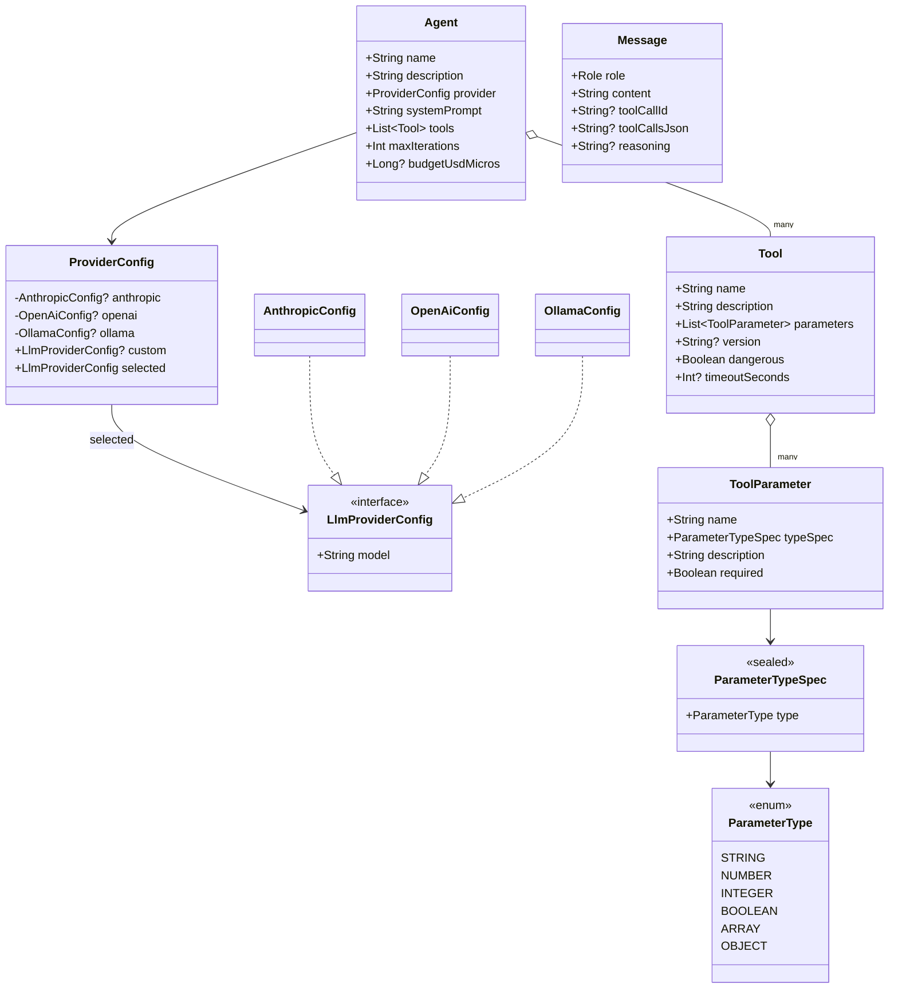

# DSL Reference

`ino-dsl` is a pure-data Kotlin module. Every type is annotated with `@GeneratedDsl` from konstellation, which runs at
KSP time to emit a typed builder for each type. Any annotated with `@RootDsl` will get a helper function
which provides the builder. The result is a typed declarative DSL for agents, tools, parameters, and provider
configurations — with compile-time scope checking via `@DslMarker`.

## Type map



## Full agent definition example

```kotlin
import org.khorum.oss.ino.dsl.*
import org.khorum.oss.ino.dsl.ParameterTypeSpec.*

val researchAgent = agent("research") {
    description = "Answers questions using web + filesystem"
    provider {
        anthropic {
            model = "claude-opus-4-7"
            temperature = 0.7
            maxOutputTokens = 4096
        }
    }
    systemPrompt = """
        You are a careful research assistant. Cite sources.
    """.trimIndent()
    tools {
        tool {
            name = "web_search"
            description = "Search the web for a query."
            parameters {
                toolParameter {
                    name = "query"
                    typeSpec = StringSpec
                    description = "The search query."
                    required()
                }
                toolParameter {
                    name = "limit"
                    typeSpec = IntegerSpec
                    description = "Maximum number of results."
                }
            }
        }
        tool {
            name = "file_read"
            description = "Read a file by absolute path."
            parameters {
                toolParameter {
                    name = "path"
                    typeSpec = StringSpec
                    required()
                }
            }
        }
    }
    maxIterations = 50
    budgetUsdMicros = 1_000_000  // $1 cap
}
```

## Type catalog

### `Agent` (`Agent.kt`)

Root DSL type. Created via `agent("name") { … }` (the `name = "agent"` arg on `@GeneratedDsl` controls the top-level
helper).

| Field             | Type             | Default  | Notes                                                               |
|-------------------|------------------|----------|---------------------------------------------------------------------|
| `name`            | `String`         | required | Agent identifier                                                    |
| `description`     | `String`         | `""`     | Human-readable description                                          |
| `provider`        | `ProviderConfig` | required | The chosen LLM provider, declared via nested `provider { … }` block |
| `systemPrompt`    | `String`         | `""`     | System message prepended to every conversation                      |
| `tools`           | `List<Tool>`     | `[]`     | `@ListDsl`-annotated; declared via `tools { tool { … } }` block     |
| `maxIterations`   | `Int`            | `25`     | Max tool-call cycles before forced halt                             |
| `budgetUsdMicros` | `Long?`          | `null`   | Cost cap in USD micros; `null` = unlimited                          |

Annotated with `@Enhancement` documenting deferred fallback support, per-tool budget caps, and scheduled execution
metadata.

### `ProviderConfig` (`LlmProviderConfig.kt`)

Wrapper for the `provider { … }` block on an Agent. Exactly one inner config must be set; the `init` block enforces this
at construction time.

```kotlin
provider {
    anthropic { model = "claude-opus-4-7" }   // built-in, block-style only
}
// or for a third-party provider:
provider {
    custom = AzureOpenAiConfig(model = "gpt-5", endpoint = "...")  // public escape hatch
}
```

The `selected: LlmProviderConfig` (annotated `@TransientDsl`) returns the chosen config regardless of which slot held
it.

### `LlmProviderConfig` (interface)

The contract any provider config implements. Built-in implementations: `AnthropicConfig`, `OpenAiConfig`,
`OllamaConfig`. Third parties implement this interface and register a matching `LlmProvider` via `ServiceLoader`.

| Provider          | Required | Optional fields                                                                                                                                                |
|-------------------|----------|----------------------------------------------------------------------------------------------------------------------------------------------------------------|
| `AnthropicConfig` | `model`  | `apiKeyEnvVar` (default `ANTHROPIC_API_KEY`), `baseUrl`, `temperature`, `maxOutputTokens`, `timeoutSeconds` (120), `anthropicVersion` (`"2023-06-01"`)         |
| `OpenAiConfig`    | `model`  | `apiKeyEnvVar` (default `OPENAI_API_KEY`), `baseUrl`, `temperature`, `maxOutputTokens`, `timeoutSeconds` (120), `organization`, `project`, `parallelToolCalls` |
| `OllamaConfig`    | `model`  | `host` (default `http://localhost:11434`), `temperature`, `maxOutputTokens`, `timeoutSeconds` (120), `keepAliveSeconds`                                        |

API keys are referenced **by env-var name**; the actual key value is never stored in the DSL.

### `Tool` (`Tool.kt`)

Declarative description of a callable tool. The actual suspend execution body lives in a `ToolHandler` impl (in an
extension JAR), keyed by `Tool.name`. See [engine.md](engine.md#toolhandler-spi).

| Field            | Type                  | Default  | Notes                                                                |
|------------------|-----------------------|----------|----------------------------------------------------------------------|
| `name`           | `String`              | required | Identifier matched against `ToolHandler.name`                        |
| `description`    | `String`              | `""`     | Sent to the LLM; influences when the model picks this tool           |
| `parameters`     | `List<ToolParameter>` | `[]`     | `@ListDsl` — declared via `parameters { toolParameter { … } }` block |
| `version`        | `String?`             | `null`   | Reserved for skill-style versioning                                  |
| `dangerous`      | `Boolean`             | `false`  | Reserved for runtime user-approval gating                            |
| `timeoutSeconds` | `Int?`                | `null`   | Per-tool override; `null` defers to agent default                    |

### `ToolParameter` + `ParameterTypeSpec` + `ParameterType` (`ToolParameter.kt`)

Three types working in conjunction:

- `ParameterType` (enum): `STRING`, `NUMBER`, `INTEGER`, `BOOLEAN`, `ARRAY`, `OBJECT` — the JSON Schema type tag.
- `ParameterTypeSpec` (sealed interface): structural representation, each variant exposing its `type: ParameterType` for
  cheap dispatch. MVP variants: `StringSpec`, `NumberSpec`, `IntegerSpec`, `BooleanSpec`. `ArraySpec(elementTypeSpec)`
  and `ObjectSpec(properties)` are scaffolded for phase-2 nesting.
- `ToolParameter` (data class): `name`, `typeSpec`, `description`, `required` — annotated with `@Enhancement` for
  deferred constraint fields (regex, min/max, enum values, default values, nested schemas).

### `Message` (`Message.kt`)

Single conversation message. Used as DSL-buildable seeds (e.g. system prompts) and as the read model from sessions.

| Field           | Type                                              | Default  |
|-----------------|---------------------------------------------------|----------|
| `role`          | `Role` (`SYSTEM` / `USER` / `ASSISTANT` / `TOOL`) | required |
| `content`       | `String`                                          | `""`     |
| `toolCallId`    | `String?`                                         | `null`   |
| `toolCallsJson` | `String?`                                         | `null`   |
| `reasoning`     | `String?`                                         | `null`   |

## Custom annotations

### `@Enhancement(description: String)` (`Enhancement.kt`)

Source-retention marker noting deferred work. Used to document properties or types that intentionally omit known-needed
fields for the current milestone.

```kotlin
@Enhancement(description = "string regex/format/length; integer & number min/max; enum values")
data class ToolParameter(...)
```

### `@InoDsl` (`InoDsl.kt`)

`@DslMarker` annotation. Konstellation stamps it on every generated builder, giving compile-time scope checking inside
nested DSLs.

## Konstellation gotchas worth knowing

1. **`@GeneratedDsl(name = "X")` controls the top-level helper but renames the builder class.** If a parent type
   references this class via `@ListDsl` or as a nested field, the reference will break. Drop the `name` override on any
   type used as a child somewhere — top-level helpers can still be controlled by the property name on the parent.
2. **Computed properties (`val foo: T get() = …`) are picked up by konstellation's builder generator** unless tagged
   `@TransientDsl`. Always tag them.
3. **`private val` on a nested DSL field generates only the block helper**, not direct assignment. Use this when you
   want users to call `field { … }` exclusively.
4. **`init` blocks on data classes work fine with konstellation** — the generated `build()` calls the primary
   constructor, which triggers the init validation.

See `Tool.kt`, `ToolParameter.kt`, and `LlmProviderConfig.kt` source comments for the inline notes that record these
decisions.

## Generated artifacts

After `./gradlew :ino-dsl:build`, the KSP processor emits these into
`build/generated/ksp/main/kotlin/org/khorum/oss/ino/dsl/`:

| File                    | Builder                     | Top-level helper                              |
|-------------------------|-----------------------------|-----------------------------------------------|
| `AgentDsl.kt`           | `AgentDslBuilder`           | `agent("name") { … }`                         |
| `ProviderConfigDsl.kt`  | `ProviderConfigDslBuilder`  | `providerConfig { … }` (rarely used directly) |
| `AnthropicConfigDsl.kt` | `AnthropicConfigDslBuilder` | `anthropicConfig { … }`                       |
| `OpenAiConfigDsl.kt`    | `OpenAiConfigDslBuilder`    | `openAiConfig { … }`                          |
| `OllamaConfigDsl.kt`    | `OllamaConfigDslBuilder`    | `ollamaConfig { … }`                          |
| `ToolDsl.kt`            | `ToolDslBuilder`            | `tool { … }`                                  |
| `ToolParameterDsl.kt`   | `ToolParameterDslBuilder`   | `toolParameter { … }`                         |
| `MessageDsl.kt`         | `MessageDslBuilder`         | `message { … }`                               |
