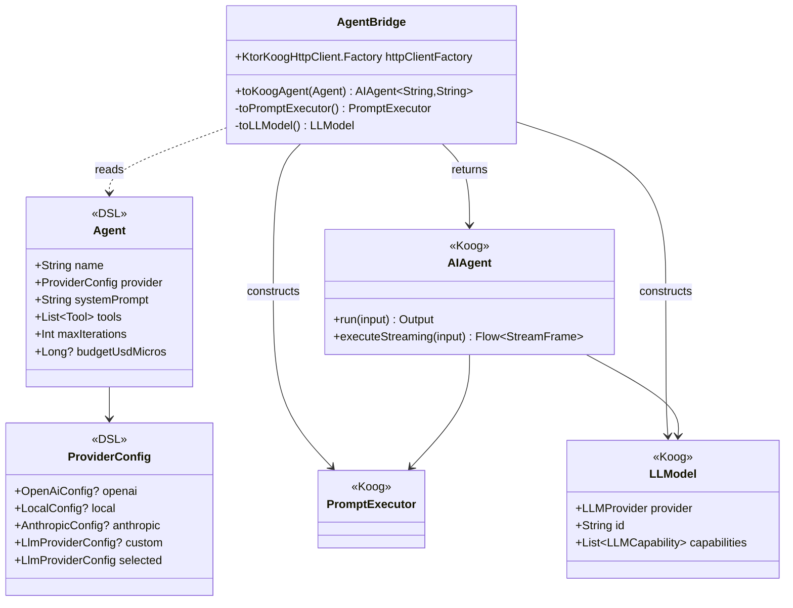
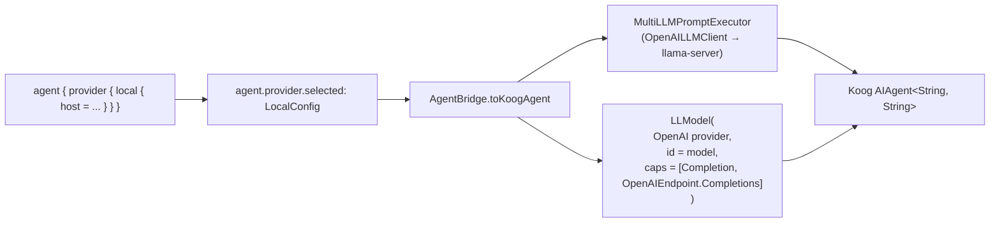
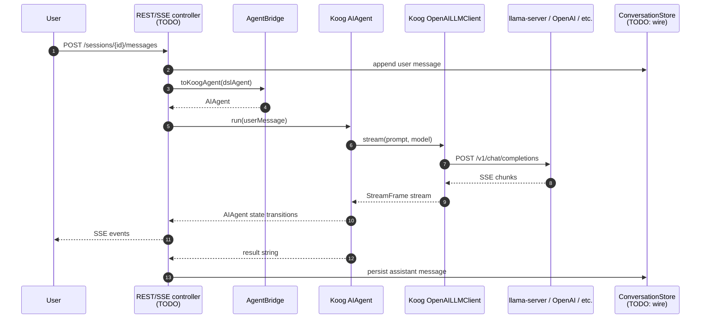

# Engine

The engine in `ino-core` doesn't run the agent loop itself — it delegates to **Koog** (`ai.koog:koog-agents:1.0.0`), JetBrains' Kotlin agent framework. The work `ino-core` *does* own is:

- **Translation**: turn a konstellation DSL `Agent` into a Koog `AIAgent` (`AgentBridge`)
- **Wiring**: register the right Koog `LLMClient` / `PromptExecutor` / `LLModel` for each provider variant
- **Persistence**: surface Koog's conversation events back into the SQLite store (sessions, messages, tool_invocations)
- **REST/SSE surface**: stream Koog's events to the dashboard

This document covers the engine boundary as it stands today. The original spec called for custom `LlmProvider` / `ToolHandler` / `CompletionEvent` SPIs; those were dropped when we adopted Koog. See `roadmap.md` decision log for the rationale.

## What Koog provides (so we don't reinvent it)

| Concern | Koog | Notes |
|---|---|---|
| LLM clients | `OpenAILLMClient`, `AnthropicLLMClient`, `GoogleLLMClient`, `OllamaLLMClient`, `MistralAIClient`, `DeepSeekClient`, `OpenRouterClient`, `BedrockClient` | One artifact (`koog-agents`) pulls them all |
| Multi-provider routing | `MultiLLMPromptExecutor(*clients)` | Routes by `LLMModel.provider` enum |
| Agent loop | `AIAgent<Input, Output>` | Built-in iteration, tool dispatch, message history |
| Tool definitions | `@Tool`-annotated functions or `ToolSet` classes | Registered via `ToolRegistry.builder()` |
| Streaming | `executeStreaming()` returning `Flow<StreamFrame>` | Per-token chunks + tool-call frames |
| Graph strategies | `AIAgentGraphStrategy` | DAG of LLM nodes / tool execution / branching — strictly more powerful than a linear loop |
| Fallback chains | `PromptExecutor` fallback config | Switch providers on rate-limit or error |
| MCP integration | First-class | Connect to MCP servers as tool sources |

## What we own



`AgentBridge.toKoogAgent(dslAgent)` is the join. Everything else is plumbing.

## `AgentBridge` — the translator

Located at `org.khorum.oss.ino.core.koog.AgentBridge`. Stateless, can be registered as a Spring `@Component` for HTTP-client-factory lifecycle hooks.

```kotlin
class AgentBridge(
    private val httpClientFactory: KtorKoogHttpClient.Factory = KtorKoogHttpClient.Factory(),
) {
    fun toKoogAgent(agent: Agent): AIAgent<String, String> {
        val cfg = agent.provider.selected
        return AIAgent(
            promptExecutor = cfg.toPromptExecutor(),
            llmModel = cfg.toLLModel(),
            systemPrompt = agent.systemPrompt,
        )
    }
    // ... toPromptExecutor() / toLLModel() — see source
}
```

### Provider config → Koog client

| DSL config | Koog client | Routing notes |
|---|---|---|
| `OpenAiConfig` | `OpenAILLMClient(apiKey, OpenAIClientSettings(baseUrl))` wrapped in `MultiLLMPromptExecutor` | API key read from `apiKeyEnvVar`; baseUrl defaults to `https://api.openai.com` |
| `LocalConfig` | Same `OpenAILLMClient`, with `apiKey=""` and `baseUrl=host` | Covers **llama-server**, **vLLM**, **Ollama's OpenAI shim** — all three speak `/v1/chat/completions` |
| `AnthropicConfig` | Not yet wired — see `// TODO(@Enhancement)` in the bridge | Phase 2 |
| `ProviderConfig.custom` | Not yet wired — registry-by-class lookup | Phase 2 |



### Capabilities — the load-bearing detail

Every `LLModel` passed to Koog needs to declare what the model supports. For OpenAI-compatible endpoints we declare exactly two:

```kotlin
listOf(
    LLMCapability.Completion,                // classic chat completion
    LLMCapability.OpenAIEndpoint.Completions // legacy /v1/chat/completions, NOT new Responses API
)
```

Without `OpenAIEndpoint.Completions`, Koog routes to the new Responses API and llama-server returns `404`. The error from Koog when the capability set is incomplete is:

```
IllegalStateException: Unsupported OpenAI API endpoint for model: <id>
```

This is a footgun. The bridge defines the capability list once as a constant; future variants follow the same pattern.

## End-to-end request flow (current)



Two pieces are still TODO:
- The REST/SSE controller layer (next planned step)
- Persistence wiring inside the loop — the bridge today produces a fresh `AIAgent` per call; conversation history needs to be threaded through

## Streaming

Koog's streaming surface is `executeStreaming(prompt, model, tools)` → `Flow<StreamFrame>`. Each frame is one of several variants:
- text deltas (per-token output)
- tool-call frames (name + arguments JSON, sometimes streamed)
- completion-end frame

The REST/SSE controller layer will translate `Flow<StreamFrame>` into the SSE format described in [api.md](api.md). The translation is mechanical; no new abstraction needed.

## Tools

Koog tools are either:
- `@Tool`-annotated methods on a `ToolSet` class — convenient for built-ins
- Custom `Tool` instances registered with `ToolRegistry.builder().tool(...)`

The bridge currently doesn't translate DSL `Tool` declarations into Koog tools — that's a phase-1.5 enhancement. Two strategies on the table:

1. **Reflection-based**: walk `Agent.tools`, look up matching `@Component`-annotated `ToolSet` beans by `Tool.name`, register them with Koog's `ToolRegistry`. DSL declares; bean provides implementation.
2. **DSL-emitted bridge**: konstellation generates a Koog-compatible tool class per `Tool` declaration. Heavier but compile-time-checked.

Strategy 1 is simpler and is the planned next step after REST/SSE controllers land.

## Resilience

Koog handles retry and provider fallback internally — set up via `MultiLLMPromptExecutor` configuration. The bridge today uses the default policy. Customization (per-provider retry counts, fallback chain order) is a phase-2 concern when multi-provider deployments arrive.

Cancellation: the caller's `CoroutineScope` is the source of truth. `DELETE /sessions/{id}/run` will cancel the scope; Koog stops cleanly mid-stream.

## Testing

The bridge is covered at three layers:

| Layer | File | What it tests |
|---|---|---|
| Pure unit | `AgentBridgeTest` | DSL config → Koog `LLModel` mapping, unsupported-variant errors |
| Wire smoke | `LlamaServerSmokeTest` | Koog → llama-server hand-wired (no bridge) |
| Bridge smoke | `KoogBridgeLlamaSmokeTest` | DSL → bridge → Koog → llama-server end-to-end |

Both smoke tests are gated by `INO_LIVE_LLAMA=1` and require llama-server running locally. They never run in CI.

```bash
# Bring up llama-server first, then:
INO_LIVE_LLAMA=1 ./gradlew :ino-core:test --tests "*LlamaServerSmokeTest*"
INO_LIVE_LLAMA=1 ./gradlew :ino-core:test --tests "*KoogBridgeLlamaSmokeTest*"
```

See [testing.md](testing.md) for the broader test strategy.
