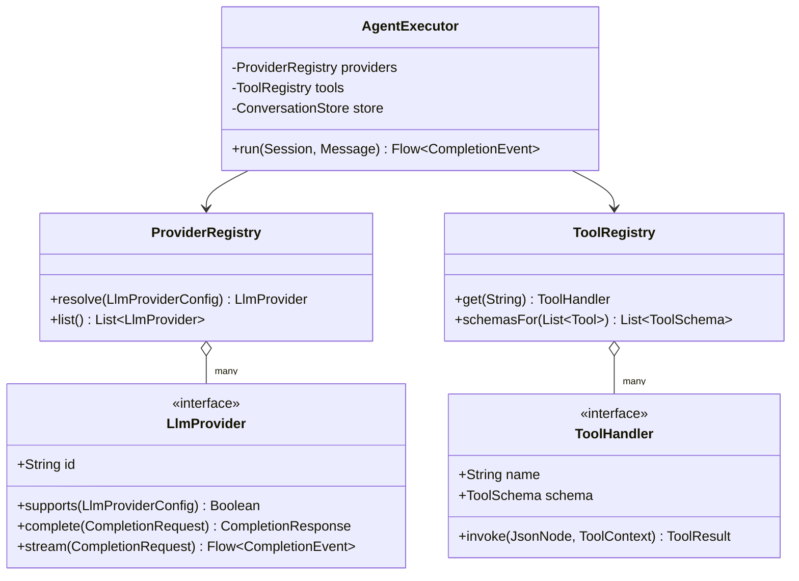
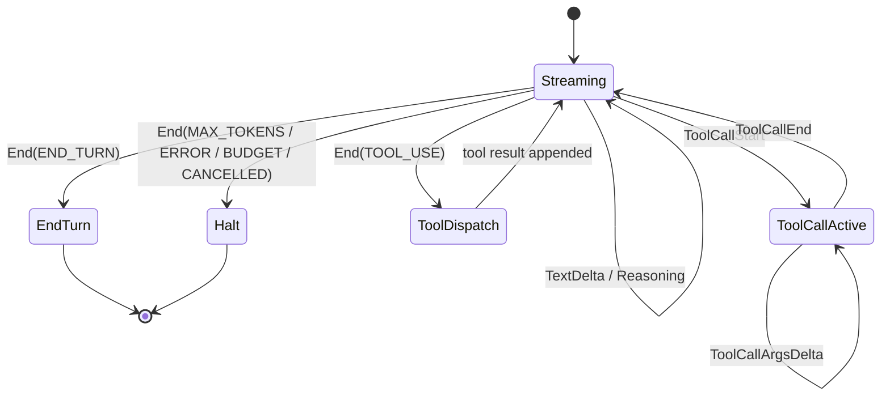
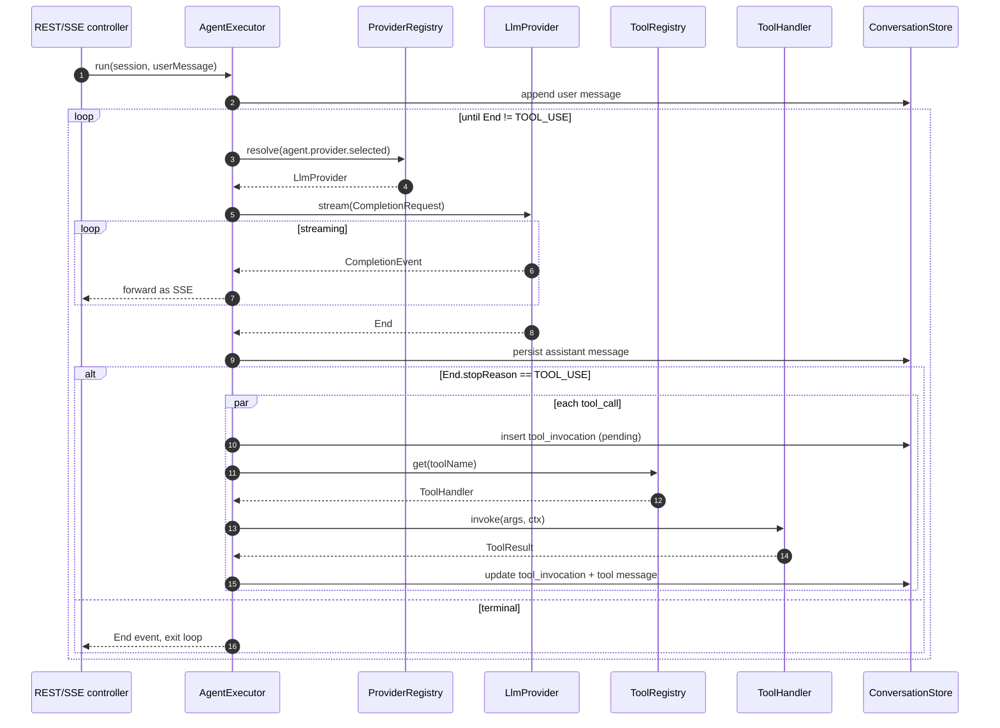
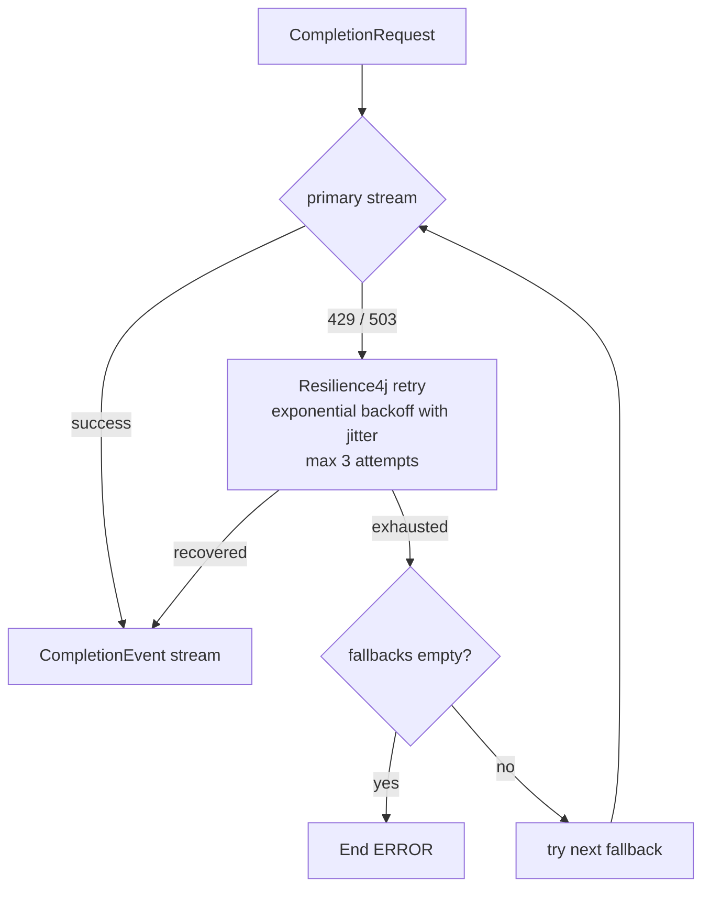
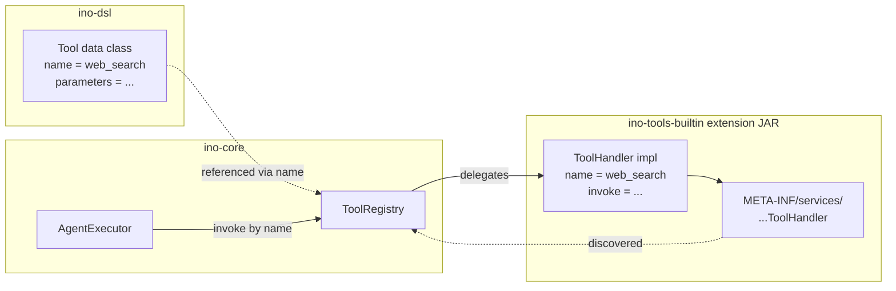

# Engine, Provider SPI, Tool SPI

The engine in `ino-core` runs the agent loop: pulls a `CompletionRequest` together, drives an `LlmProvider` stream, dispatches tool calls back to a `ToolHandler`, and persists results. Two SPIs make the engine extensible without modifying core.

## The two SPIs

```kotlin
interface LlmProvider {
    val id: String                                       // "anthropic" | "openai" | "ollama"
    fun supports(config: LlmProviderConfig): Boolean     // sealed-type matcher
    suspend fun complete(req: CompletionRequest): CompletionResponse
    fun stream(req: CompletionRequest): Flow<CompletionEvent>
}

interface ToolHandler {
    val name: String
    val schema: ToolSchema                               // generated from @GeneratedDsl Tool
    suspend fun invoke(args: JsonNode, ctx: ToolContext): ToolResult
}
```

Both registered via `META-INF/services/…`. `ProviderRegistry` and `ToolRegistry` are Spring beans that load via `ServiceLoader` at startup and additionally scan `~/.ino/extensions/*.jar` (URLClassLoader) for runtime additions.



## Unified stream type

Each provider speaks a different wire format (Anthropic SSE with `input_json_delta`, OpenAI Chat Completions chunks, Ollama JSON-NL). Each adapter normalizes into one internal sealed type so the dashboard sees one stable shape regardless of provider:

```kotlin
sealed interface CompletionEvent {
    data class TextDelta(val text: String) : CompletionEvent
    data class Reasoning(val text: String) : CompletionEvent
    data class ToolCallStart(val id: String, val name: String) : CompletionEvent
    data class ToolCallArgsDelta(val id: String, val argsJsonChunk: String) : CompletionEvent
    data class ToolCallEnd(val id: String) : CompletionEvent
    data class End(val stopReason: StopReason, val usage: TokenUsage) : CompletionEvent
}

enum class StopReason { END_TURN, TOOL_USE, MAX_TOKENS, ERROR, BUDGET_EXHAUSTED, CANCELLED }
```

This is the single most load-bearing abstraction in the framework. New event types (citations, web-search results, computer-use screenshots) become new variants — additive rather than breaking.



## Execution loop



### Loop guards

- **Max iterations**: `Agent.maxIterations` (default 25). Cycle counter incremented on each `End(TOOL_USE)`. Hitting the cap emits `End(MAX_TOKENS)`-equivalent and halts.
- **Cost budget**: `Agent.budgetUsdMicros`. Engine accumulates `usage.costUsdMicros` per stream; crossing the cap emits `End(BUDGET_EXHAUSTED)`.
- **Cancellation**: `DELETE /sessions/{id}/run` cancels the structured `CoroutineScope` tied to the session. Partial state already persisted survives; the engine emits `End(CANCELLED)`.

### Backpressure

The SSE channel uses Flow `BUFFER`/`DROP_OLDEST` strategies so a slow client doesn't stall the LLM stream. The store accumulates assistant message text in memory until `End`, then writes once.

## Resilience



- Per-provider Resilience4j policy: retry on `429` and `503` with exponential backoff and jitter, max 3 attempts.
- Fallback chain via `LlmProviderConfig.fallbacks: List<LlmProviderConfig>` (deferred — see `Agent.kt` `@Enhancement` annotation).
- **Tool errors are not retried by the engine.** They flow back to the LLM as `tool` role messages with structured error JSON; the model can self-correct.

## Handler-attachment pattern

Konstellation can't generate a DSL for a property typed as a `suspend (...) -> ToolResult` lambda. So tools split into two halves:

- **Declaration** (`Tool` data class in `ino-dsl`): name, description, parameter schema. Pure data. Travels via DSL.
- **Implementation** (`ToolHandler` in an extension JAR): the actual suspend execution body. Registered via `ServiceLoader` and looked up by `Tool.name`.

The engine binds the two at registry lookup time. Tests can inject an `InMemoryToolRegistry` fixture without needing extension JARs on the classpath.



## Tool schema rendering

The generated `Tool` + `ToolParameter` declarations are provider-agnostic. At session start, `ToolRegistry.schemasFor(agent.tools)` walks each agent's tools and renders them into the JSON Schema shape each provider expects:

- **Anthropic**: `tools: [{name, description, input_schema: {…}}]`
- **OpenAI**: `tools: [{type: "function", function: {name, description, parameters: {…}}}]`
- **Ollama**: `tools: [{type: "function", function: {name, description, parameters: {…}}}]`

The renderer pattern-matches on `ParameterTypeSpec`:

```kotlin
fun ParameterTypeSpec.toJsonSchemaTypeJson(): JsonObject = when (this) {
    is StringSpec  -> json { "type" to "string" }
    is NumberSpec  -> json { "type" to "number" }
    is IntegerSpec -> json { "type" to "integer" }
    is BooleanSpec -> json { "type" to "boolean" }
    // is ArraySpec  -> json { "type" to "array"; "items" to elementTypeSpec.toJsonSchemaTypeJson() }
    // is ObjectSpec -> json { "type" to "object"; "properties" to ... }
}
```

When phase-2 `ArraySpec`/`ObjectSpec` arrive, they slot in via the same `when`.
