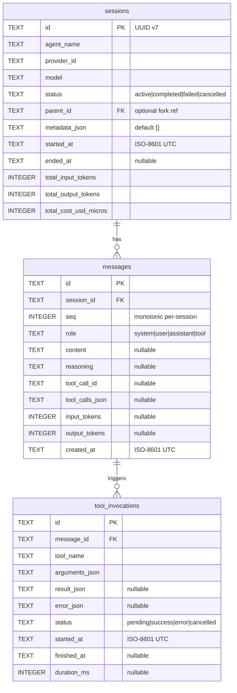
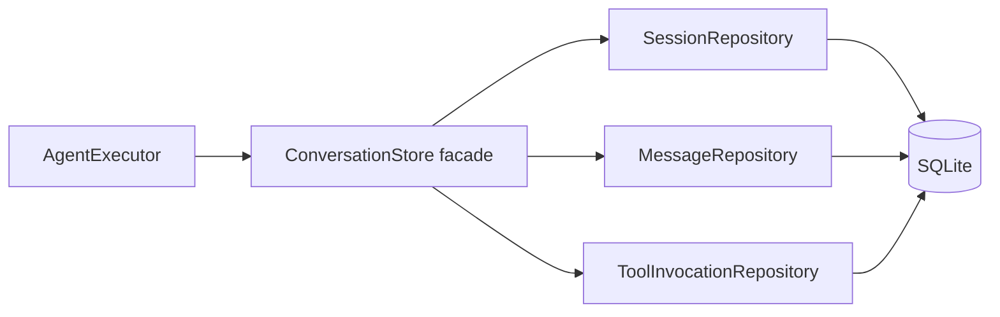

# Persistence

`ino-core` persists everything in a single SQLite database (`~/.ino/state.db` by default), managed by Liquibase. Three tables, hand-mapped via Spring's `JdbcClient`.

## Why SQLite

- **Portable.** One file, no daemon. Mirrors hermes-agent's `state.db` so hermes users can grok the layout.
- **Fast enough.** WAL mode + a single-writer Hikari pool comfortably handles tens of thousands of messages per session.
- **Future-flexible.** When phase-2 needs Postgres (multi-tenant deployments), the schema and `JdbcClient` queries port directly.

Driver: `org.xerial:sqlite-jdbc`. Pragmas at connection init:

```
journal_mode = WAL
foreign_keys = ON
synchronous  = NORMAL
```

Hikari config: separate read/write pools; the write pool size is **1** because SQLite serializes writes anyway.

## Schema



### Liquibase changesets

Live under `ino-core/src/main/resources/db/changelog/`:

```
db.changelog-master.yaml          # includes all changesets in order
changesets/
├── 0001_initial_schema.sql
├── 0002_messages_seq_index.sql
└── 0003_tool_invocations.sql     # examples — actual numbering per release
```

Each changeset is a single migration. New tables, columns, and indexes get new files; existing files never edit. Phase-2 tables (FTS5, memory, skills) become new changesets.

### Index strategy

```sql
CREATE INDEX idx_messages_session_seq ON messages(session_id, seq);
CREATE INDEX idx_sessions_agent_started ON sessions(agent_name, started_at DESC);
CREATE INDEX idx_tool_inv_message ON tool_invocations(message_id);
```

The `(session_id, seq)` index serves the dominant query pattern: replay session messages in order. `agent_name + started_at DESC` covers the dashboard's "recent sessions for this agent" list.

## Type / value conventions

- **IDs**: UUID v7 strings. Time-ordered → friendly to indexes and to merging across nodes (relevant when phase-2 introduces session forks). String form keeps SQLite's lex-sort = chrono-sort property.
- **Timestamps**: ISO-8601 UTC TEXT (`'2026-05-04T16:23:45.123Z'`). Lex-sort matches chrono-sort. SQLite's `datetime()` / `strftime()` parse them natively. Kotlin side: `java.time.Instant`.
- **JSON columns** (`metadata_json`, `arguments_json`, `result_json`, `error_json`, `tool_calls_json`): plain `TEXT`. Serialized via Jackson with `KotlinModule()` and `JavaTimeModule()` (with `WRITE_DATES_AS_TIMESTAMPS=false`). No SQLite JSON1 functions used at the application layer to keep portability open.
- **Costs**: `INTEGER` micros (1 USD = 1_000_000 micros). No floats anywhere in the cost path — avoids drift across thousands of rollups.
- **Status enums**: `TEXT` with `CHECK` constraints. Cheaper to migrate than enum types and easy to read at the `sqlite3` CLI.

## Repository layer

One repository per aggregate, each backed by `Spring JdbcClient`:

```kotlin
@Repository
class SessionRepository(private val jdbc: JdbcClient) {
    fun create(session: Session) { /* INSERT */ }
    fun findById(id: String): Session? { /* SELECT */ }
    fun listByAgent(name: String, limit: Int, offset: Int): List<Session> { /* SELECT */ }
    fun update(session: Session) { /* UPDATE */ }
    fun bumpUsage(id: String, inputTokens: Int, outputTokens: Int, costMicros: Long) {
        jdbc.sql("""
            UPDATE sessions
            SET total_input_tokens  = total_input_tokens  + :i,
                total_output_tokens = total_output_tokens + :o,
                total_cost_usd_micros = total_cost_usd_micros + :c
            WHERE id = :id
        """.trimIndent())
            .param("id", id).param("i", inputTokens)
            .param("o", outputTokens).param("c", costMicros)
            .update()
    }
}
```

Hand-mapped row → data class via small `RowMapper` lambdas. No JPA, no Hibernate, no reflection magic.



Engine code talks only to the `ConversationStore` facade; the repos are an implementation detail. This means swapping SQLite for Postgres later is a change in one module without engine churn.

## Test isolation

`ino-test` provides `InoHomeExtension` — a JUnit `@RegisterExtension` that creates a tempdir per test, sets `INO_HOME` to point there, and tears down after. The DB file, extension scan dir, and all path-resolved config land inside the tempdir, so parallel tests don't interfere.

```kotlin
@ExtendWith(InoHomeExtension::class)
class SessionRepositoryTest {
    @Test fun `create then find returns same session`() { ... }
}
```

See [testing.md](testing.md) for the full pattern.

## Deferred to phase 2

- **FTS5 virtual table** for cross-session full-text search (mirroring hermes' `state_fts`).
- **`memory_entries`** table — structured storage for `MEMORY.md`/`USER.md`/`SOUL.md`-equivalent content.
- **`skills`** table — procedural memory (agent-authored skill YAML/Kotlin handlers).
- **Provider-specific cost reconciliation** — comparing tracked cost against authoritative invoice exports.
- **Postgres dialect** — the `JdbcClient` queries are SQL-92-leaning; the move is mostly Liquibase changesets and connection config.
