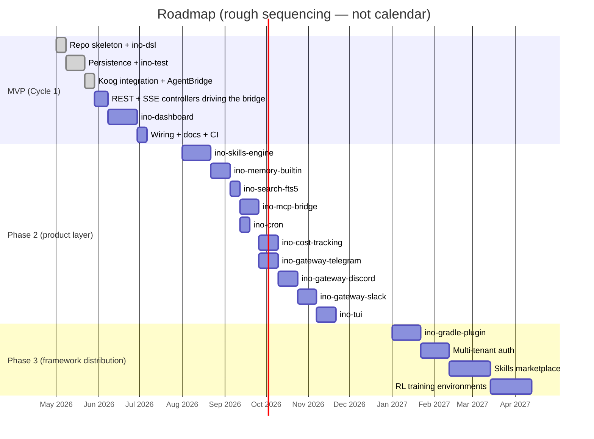
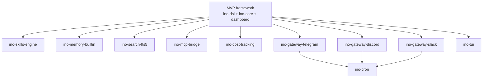

# Roadmap

Three phases. MVP delivers a small framework that proves the architecture; phase 2 stacks product features on top; phase 3 makes the whole thing distributable.

The custom engine + provider/tool SPIs originally planned for cycle-1 steps 3–6 were **dropped in favor of Koog** (JetBrains' Kotlin agent framework). The DSL we built stays; Koog replaces ~weeks of bespoke runtime code. See the decision-log entry at the bottom.

The dates are rough sequencing, not calendar commitments.

## MVP — Cycle 1

The build sequence (each step keeps the build green; each can demo independently):

| # | Step | Status |
|---|---|---|
| 1 | Repo skeleton + `ino-dsl` with konstellation wired and first annotated types compiling | **Done** |
| 2 | Persistence + `ino-test` (Liquibase changesets, `JdbcClient` repos, ephemeral SQLite, `InoHomeExtension`, fixed `Clock`) | **Done** |
| 3 | Koog integration + `AgentBridge` (DSL `Agent` → Koog `AIAgent`); live smoke against llama-server passes | **Done** |
| 4 | REST + SSE controllers driving the bridge; persistence wired to conversation flow | Pending |
| 5 | `ino-dashboard` (shell, primitives + Storybook, chat view, session list, Playwright happy paths) | Pending |
| 6 | README, configuration reference, sample agent definitions, `./gradlew bootRun` boots dashboard at `/dashboard` | Pending |
| 7 | CI workflows + first DO Spaces publish | Pending |

### MVP acceptance criteria

The green-light list — when all of these are checked, MVP ships:

- [x] Declaring an agent + tool via DSL compiles and produces a runnable definition (konstellation-generated builders exist; unit tests in `AgentBridgeTest`)
- [x] Persistence layer green: `sessions`, `messages`, `tool_invocations` tables created by Liquibase against SQLite; repos + `ConversationStore` covered by tests
- [x] `AgentBridge.toKoogAgent(dslAgent)` produces a runnable Koog agent that talks to a real LLM (verified live against llama-server's `qwen3-coder`)
- [ ] `POST /sessions` + `POST /sessions/{id}/messages` streams a Koog-driven response token-by-token end-to-end (manual smoke + scripted Playwright test)
- [ ] Dashboard shows the streamed response and tool execution live; session is browsable on refresh
- [ ] Per-module Kover ≥ 90%; Vitest ≥ 80% on `lib/`; all Playwright happy paths green; Detekt clean
- [ ] Each publishable module versions and uploads to DO Spaces via `merge-main.yml`
- [ ] `INO_HOME` isolation works: two parallel test runs don't interfere

## Phase 2 — product layer

Each becomes its own spec → plan → build cycle. Order is rough; some can run in parallel. Each ships as code added to `ino-core` (or a sibling module) — Koog itself isn't modified.

| Sub-project | Shape | Depends on |
|---|---|---|
| `ino-skills-engine` | Procedural memory: agent self-creates skills as YAML + Kotlin handler stubs; curator loop reviews/archives | MVP bridge stable |
| `ino-memory-builtin` | `MEMORY.md`, `USER.md`, `SOUL.md` files + structured `memory_entries` SQLite table | Stable conversation model |
| `ino-search-fts5` | SQLite FTS5 virtual table + cross-session retrieval tool registered with Koog's `ToolRegistry` | Adds a tool + a migration |
| `ino-mcp-bridge` | Speak MCP protocol; load MCP servers as tool sources. Koog already has MCP integration — likely a thin adapter | Koog's MCP support |
| `ino-cron` | Croniter-equivalent scheduler; runs agent sessions on schedule, delivers to channels | Trivial after gateways exist |
| `ino-cost-tracking` | Cost reconciliation, dashboard charts, budget alerts. Koog provides per-call usage data | Persistence + dashboard |
| `ino-gateway-telegram` | Telegram-bot adapter; gateway daemon multiplexes platform → session | Auth model |
| `ino-gateway-discord` | Discord adapter | Auth model |
| `ino-gateway-slack` | Slack-bolt adapter | Auth model |
| `ino-tui` | Optional terminal UI; jline-based | Lower priority than dashboard |

## Phase 3 — framework distribution

When the framework has stabilized through phase-2 use, package it for external consumption.

| Item | Notes |
|---|---|
| `ino-gradle-plugin` | Forked from `spektr-gradle-plugin`; builds & versions extension JARs with the content-hash bump pattern |
| Multi-tenant deployment | Auth via Spring Security profiles; per-tenant data isolation; row-level filtering |
| Skills marketplace / Hub interop | Compatible with `agentskills.io` format for community skill sharing |
| RL training environments | Analogue of hermes' `tinker-atropos`; trajectory generation + training loops |
| Compose Multiplatform native client | Optional native + iOS + desktop client sharing types with backend via KMP |

## Open assumptions

These are explicit so they can be revisited if circumstances change:

- **Konstellation Kotlin 2.3.0 + matching KSP**: not blocked because `ino-dsl` is on Kotlin 2.1.20 and `ino-core` is on 2.3.10; generated code is binary-compatible.
- **Spring Boot 4.1**: works fine for compile + boot. Its Liquibase autoconfig didn't activate against Liquibase 5 — wired explicitly via `@Bean` in `LiquibaseConfig`. Koog's Spring Boot starter requires Spring Boot 3, so we use plain `ai.koog:koog-agents` and wire beans ourselves.
- **`xerial-jdbc-sqlite`** covers required features (WAL, ISO-8601 datetime functions). FTS5 available when phase 2 needs it.
- **Single-user local deployment** is the MVP target.
- **No real-time agent-to-agent communication** in MVP. `sessions.parent_id` scaffolds forks; the engine doesn't multiplex yet.

## Decision log

Major shape decisions captured during brainstorming + execution:

| Decision | Choice | Why |
|---|---|---|
| Project core identity | Hybrid: framework first, product later | Matches existing spektr evolution; small surface to ship MVP |
| Backend stack | Spring Boot 4.1 / Kotlin 2.3 / Java 21 | Highest reuse from monorepo; batteries included |
| MVP providers | Anthropic + OpenAI + Local (llama-server / Ollama / vLLM) | Two cloud + one local; via Koog's clients |
| MVP persistence | SQLite | Mirror hermes; portable; one-file deploy |
| MVP UI | SvelteKit + TS + Tailwind + Storybook + Playwright | Modern, light, full testing story |
| Module shape | Single Gradle root + submodules (tabs pattern) | Less wrapper duplication than peer-roots |
| Repo location | `khorum/agents/ino/` (replaces stub) | Reuses existing directory |
| DSL framework | konstellation-dsl | KSP-generated builders; compile-time scope checking |
| `LlmProviderConfig` | `interface` (not `sealed`) | Open to third-party implementations via `custom` slot |
| Provider DSL shape | `provider { anthropic { … } }` block style | Wrapper class with `private val` slots; `init` enforces exactly-one |
| `ToolParameter` types | sealed `ParameterTypeSpec` + enum `ParameterType` in conjunction | Both fast tag + structural data |
| Deferred-work marker | `@Enhancement(description)` annotation | Discoverable via grep / IDE search; eventually upstream to konstellation |
| Timestamps | ISO-8601 UTC TEXT | Human-readable in `sqlite3` CLI; lex-sort = chrono-sort |
| Costs | `Long` micros | No float drift |
| IDs | UUID v7 | Time-ordered, mergeable across forks |
| Liquibase autoconfig | Wired explicitly as `@Bean`, not via Spring Boot 4 autoconfig | SB 4.1.0-M1 + Liquibase 5 don't auto-detect each other |
| **Agent runtime engine** | **Koog (`ai.koog:koog-agents:1.0.0`) instead of custom SPI** | Replaces planned `LlmProvider`/`ToolHandler`/`CompletionEvent` SPIs and the three provider modules with ~weeks of work saved. Koog provides multi-provider routing, streaming, tool calls, MCP, fallback chains. The konstellation DSL becomes the declarative layer; `AgentBridge` translates it to Koog at construction time. Koog's SB starter requires SB 3.x, so we wire `OpenAILLMClient` + `MultiLLMPromptExecutor` as plain Spring beans. |
| **`OpenAiConfig` vs `LocalConfig` routing** | **Both go through `OpenAILLMClient`** | llama-server, vLLM, Ollama's OpenAI shim all speak the same wire format. `LocalConfig` is `OpenAiConfig` with `apiKey=""` and a required `host`. Avoids writing a separate local-runtime bridge. |
| **Koog `LLMCapability`** | **Must include `OpenAIEndpoint.Completions`** for any custom OpenAI-compatible endpoint | Otherwise Koog throws `IllegalStateException: Unsupported OpenAI API endpoint for model: …`. Routes to legacy `/v1/chat/completions` instead of the new Responses API. |
