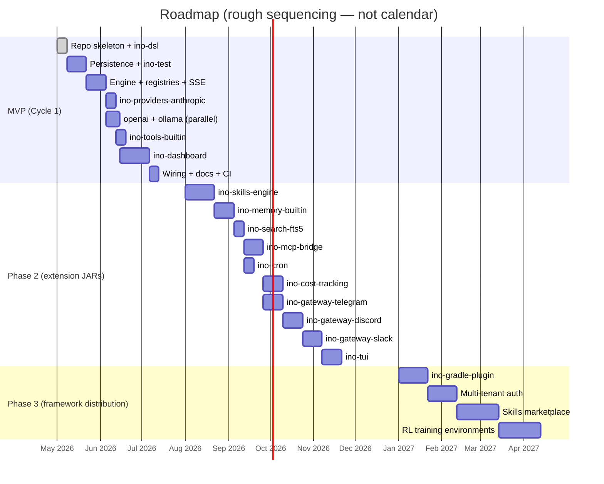
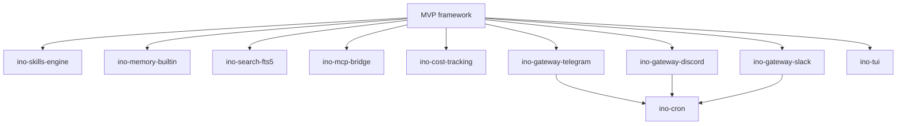

# Roadmap

Three phases. MVP delivers a small framework that proves the architecture; phase 2 stacks the hermes-style product features on top as independent extension JARs; phase 3 makes the whole thing distributable.

The dates are rough sequencing, not calendar commitments.

## MVP — Cycle 1

The build sequence (each step keeps the build green; each can demo independently):

| # | Step | Status |
|---|---|---|
| 1 | Repo skeleton + `ino-dsl` with konstellation wired and first annotated types compiling | **Done** |
| 2 | Persistence + `ino-test` (Liquibase, JdbcClient repos, ephemeral SQLite, `InMemoryLlmProvider`, `InoHomeExtension`) | Pending |
| 3 | Engine + registries + SSE API driven by `InMemoryLlmProvider` only | Pending |
| 4 | `ino-providers-anthropic` (adapter + captured fixtures + `MockWebServer` tests + ServiceLoader registration) | Pending |
| 5 | `ino-providers-openai` and `ino-providers-ollama` in parallel | Pending |
| 6 | `ino-tools-builtin` (`shell`, `http_get`, `file_read`, `file_write`, `web_search`) | Pending |
| 7 | `ino-dashboard` (shell, primitives + Storybook, chat view, session list, Playwright happy paths) | Pending |
| 8 | README, configuration reference, sample agent definitions, `./gradlew bootRun` boots dashboard at `/dashboard` | Pending |
| 9 | CI workflows + first DO Spaces publish | Pending |

### MVP acceptance criteria

The green-light list — when all of these are checked, MVP ships:

- [ ] Declaring an agent + tool via DSL compiles and produces a runnable definition (compile-time test fixture in `ino-dsl/src/test/`)
- [ ] `POST /sessions` followed by `POST /sessions/{id}/messages` streams a real Anthropic response token-by-token end-to-end (manual smoke + scripted Playwright test)
- [ ] An LLM tool call gets dispatched to a registered `ToolHandler`, result feeds back, loop continues to natural completion (E2E test with `InMemoryLlmProvider` fixture script)
- [ ] All three providers pass captured-fixture replay tests + at least one live smoke test gated behind a CI secret
- [ ] Dashboard shows the streamed response and tool execution live; session is browsable on refresh
- [ ] Per-module Kover ≥ 90%; Vitest ≥ 80% on `lib/`; all Playwright happy paths green; Detekt clean
- [ ] Each publishable module versions and uploads to DO Spaces via `merge-main.yml`
- [ ] `INO_HOME` isolation works: two parallel test runs don't interfere

## Phase 2 — product layer

Each becomes its own spec → plan → build cycle. Order is rough; some can run in parallel. Each ships as an extension JAR that depends only on `ino-dsl` + `ino-core` interfaces — none of these change `ino-core` source.

| Sub-project | Shape | Depends on |
|---|---|---|
| `ino-skills-engine` | Procedural memory: agent self-creates skills as YAML + Kotlin handler stubs; curator loop reviews/archives | MVP execution loop stable |
| `ino-memory-builtin` | `MEMORY.md`, `USER.md`, `SOUL.md` files + structured `memory_entries` SQLite table | Stable conversation model |
| `ino-search-fts5` | SQLite FTS5 virtual table + cross-session retrieval tool | Adds a tool + a migration; orthogonal once MVP ships |
| `ino-mcp-bridge` | Speak MCP protocol; load MCP servers as tool sources; each MCP server becomes a `ToolHandler` factory | Stable `ToolHandler` SPI |
| `ino-cron` | Croniter-equivalent scheduler; runs agent sessions on schedule, delivers to channels | Trivial after gateway exists |
| `ino-cost-tracking` | Cost reconciliation, dashboard charts, budget alerts | UI-heavy; nicer once dashboard primitives stabilize |
| `ino-gateway-telegram` | Telegram-bot adapter; gateway daemon multiplexes platform → session | Auth model |
| `ino-gateway-discord` | Discord adapter | Auth model |
| `ino-gateway-slack` | Slack-bolt adapter | Auth model |
| `ino-tui` | Optional terminal UI; Ink-equivalent in Kotlin (or jline-based) | Lower priority than dashboard |

## Phase 3 — framework distribution

When the framework has stabilized through phase-2 use, package it for external consumption.

| Item | Notes |
|---|---|
| `ino-gradle-plugin` | Forked from `spektr-gradle-plugin`; builds & versions extension JARs with the content-hash bump pattern |
| Multi-tenant deployment | Auth via Spring Security profiles; per-tenant data isolation; row-level filtering |
| Skills marketplace / Hub interop | Compatible with `agentskills.io` format for community skill sharing |
| RL training environments | Analogue of hermes' `tinker-atropos`; trajectory generation + training loops |
| Compose Multiplatform native client | Optional native + iOS + desktop client sharing types with backend via KMP |

## Open assumptions

These are explicit so they can be revisited if circumstances change:

- **Konstellation Kotlin 2.3.0 + matching KSP** is feasible. Fallback: keep `ino-dsl` on Kotlin 2.1.20 / Java 17 and consume generated code from Kotlin 2.3 modules (binary-compatible), at the cost of mixed Kotlin versions in the monorepo.
- **Spring Boot 4.1** ships Spring Framework 7 with `JdbcClient` and SSE primitives — none are blocking unknowns, but version pins should be checked at first compile.
- **`xerial-jdbc-sqlite`** covers all required SQLite features (WAL, pragmas, ISO-8601 datetime functions). Exotic features like FTS5 tokenizers are available in the same driver when phase 2 needs them.
- **Single-user local deployment** is the MVP target. Multi-user / multi-tenant ships in phase 3.
- **No real-time agent-to-agent communication** in MVP. Forks (parent/child sessions) are scaffolded in the schema but the engine doesn't multiplex yet.

## Decision log (so far)

Major shape decisions captured during brainstorming:

| Decision | Choice | Why |
|---|---|---|
| Project core identity | Hybrid: framework first, product later | Matches existing spektr evolution; small surface to ship MVP |
| Backend stack | Spring Boot 4.1 / Kotlin 2.3 / Java 21 | Highest reuse from monorepo; batteries included |
| MVP providers | Anthropic + OpenAI + Ollama | Two cloud + one local; covers the abstraction surface |
| MVP persistence | SQLite | Mirror hermes; portable; one-file deploy |
| MVP UI | SvelteKit + TS + Tailwind + Storybook + Playwright | Modern, light, full testing story |
| Module shape | spektr-mirror (tiny core + ServiceLoader extension JARs) | Reuses existing publish/CI/Gradle plugin infra |
| Repo location | `khorum/agents/ino/` (replaces stub) | Single Gradle root with submodules (tabs pattern) |
| DSL framework | konstellation-dsl | KSP-generated builders; compile-time scope checking |
| `LlmProviderConfig` | `interface` (not `sealed`) | Open to third-party implementations |
| Provider DSL shape | `provider { anthropic { … } }` block style | Wrapper class with `private val` slots |
| `ToolParameter` types | sealed `ParameterTypeSpec` + enum `ParameterType` in conjunction | Both fast tag + structural data |
| Deferred-work marker | `@Enhancement(description)` annotation | Discoverable via grep / IDE search; eventually upstream to konstellation |
| Timestamps | ISO-8601 UTC TEXT | Human-readable in `sqlite3` CLI; lex-sort = chrono-sort |
| Costs | `Long` micros | No float drift |
| IDs | UUID v7 | Time-ordered, mergeable across forks |
