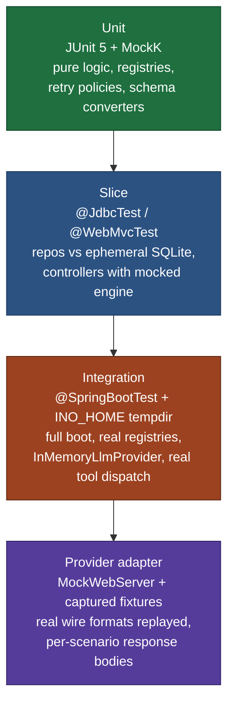
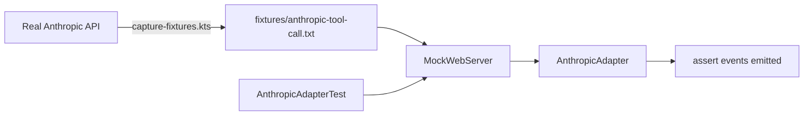

# Testing Strategy

Across the whole repo, four backend test layers plus four frontend layers. The `ino-test` module is the keystone: it ships an `InMemoryLlmProvider`, an `INO_HOME` JUnit extension, and shared fixtures that all other modules consume.

## Backend test pyramid



| Layer | Framework | Scope |
|---|---|---|
| **Unit** | JUnit 5 + MockK | Pure logic: registries, schema converters, executor decision-tree, retry policies, cost rollups |
| **Slice** | Spring `@JdbcTest` / `@WebMvcTest` | Repositories against ephemeral SQLite; controllers with mocked engine |
| **Integration** | `@SpringBootTest` + `INO_HOME` tempdir | Full boot, real registries, `InMemoryLlmProvider` from `ino-test`, real tool dispatch |
| **Provider adapter** | per-provider module: `MockWebServer` (OkHttp) + captured fixtures | Replays real Anthropic/OpenAI/Ollama responses so adapters are tested without live API calls |

## Test isolation: `INO_HOME` extension

Mirrors hermes-agent's `HERMES_HOME` trick. Each integration test gets its own tempdir; all path-resolved config (DB file, extension scan dir, logs) lives inside it.

```kotlin
class InoHomeExtension : BeforeEachCallback, AfterEachCallback {
    private lateinit var tempDir: Path
    override fun beforeEach(ctx: ExtensionContext) {
        tempDir = Files.createTempDirectory("ino-home-")
        System.setProperty("ino.home", tempDir.toString())
    }
    override fun afterEach(ctx: ExtensionContext) {
        tempDir.toFile().deleteRecursively()
        System.clearProperty("ino.home")
    }
}

@ExtendWith(InoHomeExtension::class)
class SessionRepositoryTest { ... }
```

Plus a `@BeforeAll` in `conftest`-equivalent that scrubs credential env vars (`ANTHROPIC_API_KEY`, `OPENAI_API_KEY`, etc.) so provider tests never accidentally leak through to a real API.

## Deterministic clock

Spring exposes a `Clock` bean. Production wires `Clock.systemUTC()`; tests inject `Clock.fixed(Instant.parse("2026-01-01T00:00:00Z"), ZoneOffset.UTC)` so every timestamp in fixtures is stable.

```kotlin
@TestConfiguration
class FixedClockConfig {
    @Bean @Primary fun fixedClock(): Clock =
        Clock.fixed(Instant.parse("2026-01-01T00:00:00Z"), ZoneOffset.UTC)
}
```

## Provider adapter tests

The high-leverage layer. Every provider adapter is exercised against captured response bodies, replayed via `MockWebServer`. One captured fixture per provider per scenario:

| Scenario | What it tests |
|---|---|
| `text-only` | Adapter emits `TextDelta` events, ends with `End(END_TURN)` |
| `tool-call` | Adapter emits `ToolCallStart`/`ArgsDelta`/`End`, ends with `End(TOOL_USE)` |
| `streaming-text` | Multi-chunk text accumulation in correct order |
| `streaming-tool-call` | Mid-stream tool call interleaved with text |
| `error-429` | Adapter throws `RateLimitedException`; Resilience4j retries |
| `error-500` | Adapter throws `ProviderException`; halts with `End(ERROR)` |
| `partial-cutoff` | Stream truncated mid-message; adapter handles gracefully |



`scripts/capture-fixtures.kts` records real API responses against a sandbox key. Captured bodies are scrubbed for keys/PII before commit.

## `InMemoryLlmProvider` (in `ino-test`)

Deterministic fake `LlmProvider` driven by a fixture script:

```kotlin
val provider = InMemoryLlmProvider.scripted {
    on(turn = 0) {
        textDelta("Looking up ")
        textDelta("the weather…")
        toolCall(name = "web_search", argsJson = """{"query":"…"}""")
        end(StopReason.TOOL_USE)
    }
    on(turn = 1) {
        textDelta("It's sunny in SF.")
        end(StopReason.END_TURN)
    }
}
```

Used by:
- `ino-core` integration tests (engine doesn't need a real LLM API)
- `ino-dashboard` Playwright E2E (boots `ino-core` with this provider, scripts deterministic streams)

This is the **single most load-bearing test fixture in the project**. One format drives both backend and frontend test layers, so a regression in event ordering is caught in both.

## Frontend test layers

| Layer | Tool | Coverage target |
|---|---|---|
| Unit (`lib/`) | Vitest + `@vitest/coverage-v8` | 80%+ |
| Component | Storybook 8 + `@storybook/test` | every component has ≥1 story |
| Visual regression | Playwright snapshot per story | every primitive + chat component |
| E2E | Playwright against `ino-core` + `InMemoryLlmProvider` | 5 happy paths |

E2E happy paths:

1. Create new session → see it in session list
2. Send message → see streamed assistant response token-by-token
3. Tool-call loop → see `ToolCallCard` pending → success
4. Cancel mid-stream → see `End(cancelled)`, partial state preserved
5. Refresh → resume conversation from history

## Coverage gates

- **Backend (Kover XML)**: per-module **≥ 90%**. A 100%-covered DSL module can't compensate for a 60%-covered provider adapter — each publishable artifact gates independently.
- **Frontend (Vitest V8)**: `lib/` ≥ **80%**.
- Combined Codecov upload tagged separately; SonarCloud scan reports both per-module.
- Detekt clean across all backend modules.

## Static analysis

- **Detekt** — your existing config + project-specific rules
- **Kover** — coverage gate
- **SonarCloud** — quality gate
- **CodeQL** — `java-kotlin` + `javascript` languages, weekly cron

See [cicd.md](cicd.md) for how these run in workflows.

## Deferred to phase 2

- Property-based testing (kotest-property) for parser/renderer round-trips
- Mutation testing (Pitest) on critical engine paths
- Load testing (k6) for the SSE channel under concurrent sessions
- Chaos testing for the provider fallback chain
